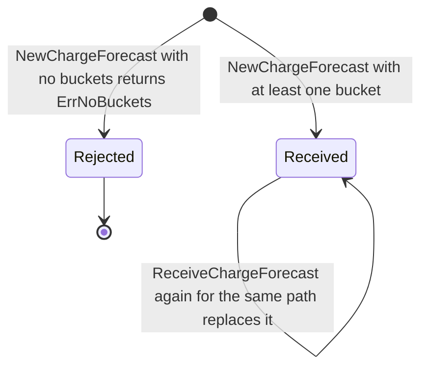
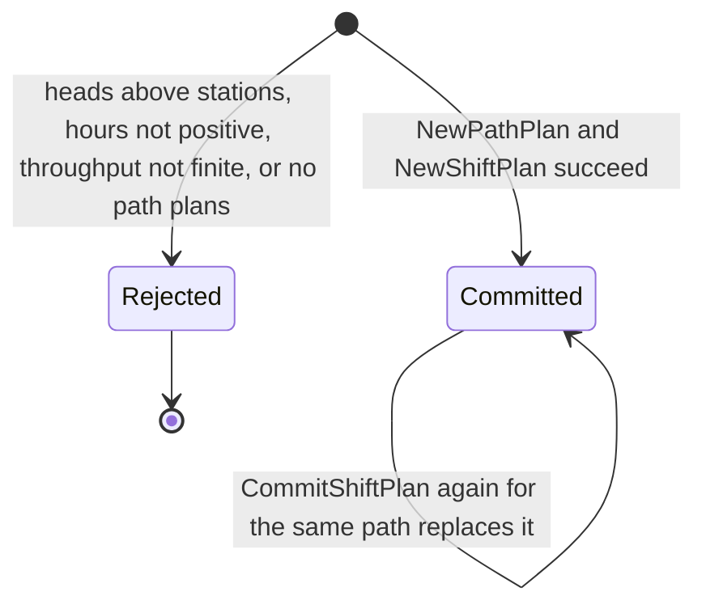
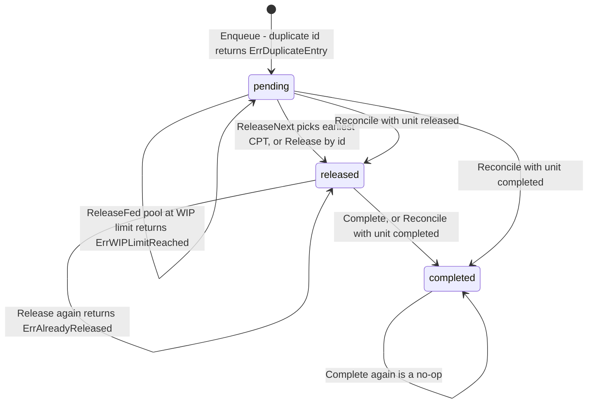
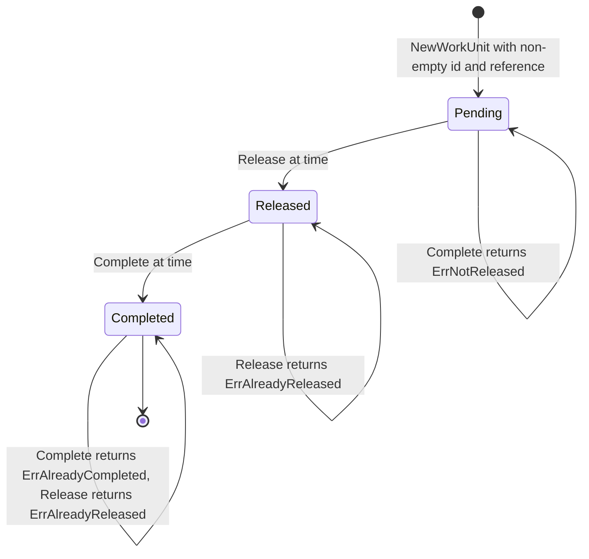

# Aggregate design canvas

One [ddd-crew Aggregate Design Canvas](https://github.com/ddd-crew/aggregate-design-canvas)
(v1.1) per aggregate root in `internal/domain`. There are **four aggregate
roots** — `ChargeForecast`, `ShiftPlan`, `WorkPool`, `WorkUnit` — plus one
domain service (`ReleasePolicy`) and five shared value objects. Every
invariant below is enforced inside the domain layer and has a failing-path
unit test next to it (`*_test.go` in the same package).

Read models are **not** aggregates and are listed separately at the
[end of this page](#not-aggregates-read-models-and-views).

## Shared value objects (`internal/domain/shared`)

| Value object | Constraint | Error on violation |
|---|---|---|
| `CPT` | wraps a `time.Time`; ordering is the domain operation (`Before`, `Equals`) | — (always valid) |
| `Rate` | units/hour, must be **positive** | `ErrInvalidRate` |
| `PathId` | must be **non-empty** | `ErrInvalidPathId` |
| `Quantity` | must be **non-negative** | `ErrInvalidQuantity` |
| `StationCount` | **non-negative** and at most `math.MaxInt32`; comparable (`LessThan`, `GreaterThan`) | `ErrInvalidStationCount` |

`hours` on a path plan is a plain `float64` validated to be positive
(`shared.ErrInvalidHours`). These exist so an illegal value cannot be
constructed at all: a negative quantity never becomes a `Quantity`.

Every aggregate is **one row (plus child rows) per process path or per work
unit**, and every aggregate-changing use case saves the aggregate and inserts
its events into the transactional outbox in one Postgres transaction
(`UnitOfWork`, [ADR-0014](../adr/0014-transactional-outbox.md)).

---

## ChargeForecast

### 1. Name

`ChargeForecast` — `internal/domain/charge/forecast.go`. Identity: the
`PathId` (one forecast per path; `charge_forecasts.path_id` is the primary
key).

### 2. Description

The volume that must clear one process path this shift, bucketed by CPT
(`[]CPTBucket`, each a `CPT` plus a `Quantity`). It is an **input fact**, not
a decision: receiving a revised forecast replaces the previous one.

### 3. State transitions

`ChargeForecast` has no status enum. Its only lifecycle is "created" and
"replaced by a newer forecast for the same path" (the Postgres repo upserts
on `path_id`).



Source: `internal/domain/charge/forecast.go`,
`internal/application/usecases/receive_charge_forecast.go`,
`internal/adapters/outbound/postgres/charge_repo.go`. Omits: the HTTP
validation of each bucket (`malformed-request-body`, `invalid-quantity`)
that happens before the aggregate is constructed.

### 4. Enforced invariants

| # | Invariant | Enforced by |
|---|---|---|
| C1 | A forecast has **at least one CPT bucket** | `NewChargeForecast` → `charge.ErrNoBuckets` |
| C2 | Querying a CPT that has no bucket is an error, not a zero | `QuantityForCPT` → `charge.ErrUnknownCPT` |
| C3 | The bucket slice is never shared with callers | `NewChargeForecast` and `Buckets()` copy the slice |

C2 matters: "nothing is due at 18:00" and "I have no idea what is due at
18:00" are operationally different answers.

### 5. Corrective policies

None. A wrong forecast is corrected by posting a new one for the path.

### 6. Handled commands

| Command | Entry point |
|---|---|
| `ReceiveChargeForecast` | `POST /paths/{pathId}/charge` |

### 7. Created events

| Event | Full CloudEvents type |
|---|---|
| `ChargeForecastReceived` | `com.warehouse.wes.work-planning.charge.ChargeForecastReceived` |

### 8. Throughput (estimate)

Estimate: low — one write per path per planning cycle (a handful per path
per shift). No concurrency control beyond the upsert; last writer wins.

### 9. Size (estimate)

Estimate: one event per instance per revision; a forecast carries one
bucket per CPT wave of the shift (tens, not thousands). Lifetime: until
replaced.

---

## ShiftPlan

### 1. Name

`ShiftPlan` — `internal/domain/plan/shift_plan.go`, composed of
`PathPlan` values (`internal/domain/plan/path_plan.go`). Identity: the
`PathId` it is saved under (`PlanRepo.Save(ctx, pathId, shiftPlan)`;
`shift_plans.path_id` is the primary key).

### 2. Description

This service's **committed** split of headcount across process paths:
`rate × plannedHeads × hours` per path. Not `workforce-management`'s
`ShiftPlan` — that one arrives as `LaborPlanObserved`, a read model
([ADR-0006](../adr/0006-labor-plan-view-not-shift-plan.md)). Today
`CommitShiftPlan` always builds a single-`PathPlan` `ShiftPlan`.

### 3. State transitions

No status enum. A plan either fails construction or is committed; a later
commit for the same path replaces it (upsert on `path_id`).



Source: `internal/domain/plan/path_plan.go`, `internal/domain/plan/shift_plan.go`,
`internal/application/usecases/commit_shift_plan.go`. Omits: the optional
travel-distance enrichment (it never changes state validity).

### 4. Enforced invariants

| # | Invariant | Enforced by |
|---|---|---|
| P1 | **`plannedHeads ≤ installedStations`** | `NewPathPlan` → `plan.ErrHeadsExceedStations` |
| P2 | `hours` must be **positive** | `NewPathPlan` → `shared.ErrInvalidHours` |
| P3 | Planned throughput must be finite | `NewPathPlan` → `plan.ErrThroughputNotFinite` |
| P4 | A shift plan has **at least one path plan** | `NewShiftPlan` → `plan.ErrNoPathPlans` |

P1 is the headline invariant: you cannot staff more people than there are
places to stand, and enforcing it at construction means an invalid plan
never exists even transiently.

### 5. Corrective policies

- **Drift reconciliation** ([ADR-0019](../adr/0019-labor-plan-committed-shift-plan-reconciliation.md)):
  inside the same transaction, `CommitShiftPlan` compares the new
  `PathPlan.PlannedHeads` with Workforce's `LaborPlanObserved` for the path
  (if one exists), stores the signed difference on the view and raises
  `PathPlanDriftDetected` when it is non-zero. `ObserveLaborPlan` runs the
  same comparison when Workforce commits second.
- **Travel-distance hint** ([ADR-0017](../adr/0017-travel-distance-lookup-on-commit-shift-plan.md)):
  fail-open; a failed lookup simply omits the hint.

### 6. Handled commands

| Command | Entry point |
|---|---|
| `CommitShiftPlan` | `POST /paths/{pathId}/plan` |

### 7. Created events

| Event | Full CloudEvents type |
|---|---|
| `ShiftPlanCommitted` | `com.warehouse.wes.work-planning.plan.ShiftPlanCommitted` |
| `PathPlanDriftDetected` (only on drift) | `com.warehouse.wes.work-planning.pathplan.PathPlanDriftDetected` |

### 8. Throughput (estimate)

Estimate: low — a few commits per path per shift. Last writer wins.

### 9. Size (estimate)

Estimate: one or two events per commit; one `PathPlan` per instance today.
Lifetime: until the next commit for the path.

---

## WorkPool

### 1. Name

`WorkPool` — `internal/domain/release/work_pool.go`. Identity: `PathId`
(exactly one pool per path; `work_pools.path_id`, with child rows in
`work_pool_entries`). Carries an optimistic-concurrency `version`
([ADR-0029](../adr/0029-work-pool-optimistic-concurrency.md)).

### 2. Description

The queue for one process path: entries keyed by work unit id, each with a
CPT and an entry state, plus the feed mode (`ReleaseFed` or `FlowFed`), the
WIP limit and the alarm threshold. Backlog depth, WIP and remaining capacity
are **computed from the entries on demand**, never stored.

### 3. State transitions

The pool itself has no status; its entries do (`entryState`: `pending`,
`released`, `completed`).



Source: `internal/domain/release/work_pool.go`,
`internal/domain/release/errors.go`. Omits: `RestoreEntry`, which only
rehydrates stored rows in the repository adapter, the pool-level
`ErrEmptyPool` / `ErrUnknownEntry` failures, and `Configure` (ADR-0034), which
sets the pool's mode and WIP limit and never changes any entry's state, so it
adds no transition: lowering the limit below the current WIP only makes the
`ErrWIPLimitReached` self-loop above apply until completions drain WIP.

### 4. Enforced invariants

| # | Invariant | Enforced by |
|---|---|---|
| W1 | **At-most-once handout** of an entry | `Release` → `release.ErrAlreadyReleased`; `ReleaseNext` only considers `pending` entries |
| W2 | **WIP limit is a hard invariant on a release-fed pool** | `ReleaseNext` / `Release` when `WIP() ≥ wipLimit` and mode is `ReleaseFed` → `release.ErrWIPLimitReached` |
| W3 | No duplicate entries | `Enqueue` / `RestoreEntry` → `release.ErrDuplicateEntry` |
| W4 | Releasing from an empty pool is an error | `ReleaseNext` → `release.ErrEmptyPool` |
| W5 | Releasing, completing or reconciling an unknown id is an error | `Release` / `Complete` / `Reconcile` → `release.ErrUnknownEntry` |
| W6 | An entry completes only after it was released | `Complete` → `release.ErrNotReleased` |
| W7 | **Earliest CPT first** — the priority function | `nextPendingIndex` |
| W8 | Concurrent saves never silently overwrite each other | `WorkPoolRepo.Save` matches `version`; zero rows → `ports.ErrConcurrentModification`, retried up to 12 times by `retryOnPoolConflict`, then HTTP 409 `concurrent-modification` |
| W9 | **The WIP limit is a positive integer and the mode a known `FeedMode`; reconfiguring never evicts work** | `Configure` → `release.ErrInvalidWIPLimit` / `release.ErrUnknownFeedMode` (HTTP 400); entries are untouched, so lowering the limit below the current WIP just pauses releases (W2) until WIP < limit ([ADR-0034](../adr/0034-configure-pool-command.md)) |

W2 is conditional by design: on a **flow-fed** pool the WIP limit is not
enforced and only `alarmThreshold` applies (`IsOverAlarmThreshold`). You can
only enforce a limit on an input you control
([ADR-0003](../adr/0003-flow-balancing-as-domain-service.md)). A pool becomes
flow-fed only through `ConfigurePool` (W9); an unconfigured path keeps the
`ReleaseFed` / 1000 fallback.

### 5. Corrective policies

- **Stale-entry healing on release**: if `ReleasePolicy.Apply` picks an entry
  whose `WorkUnit` is already Released or Completed, `ReleaseNextWork` calls
  `Reconcile` and picks again, instead of wedging the path.
- **Completion frees the WIP slot**: `RecordCompletion` reconciles the pool
  entry to `completed` in the same transaction as the `WorkUnit` save.
- **Flow balancing** ([ADR-0003](../adr/0003-flow-balancing-as-domain-service.md)):
  `RebalanceDecision` recommends `ThrottleUpstream` (flow-fed, over alarm
  threshold) or `ReassignLabor` (release-fed, at WIP limit with backlog).
- **Optimistic-concurrency retry** (W8).

### 6. Handled commands

| Command | Entry points | Pool method |
|---|---|---|
| `EnqueueWorkUnit` | `POST /paths/{pathId}/work-units` (`Idempotency-Key` with Postgres); `ApplyOrderAllocated` from Kafka | `Enqueue` (creates the pool on first enqueue **if none was configured**: `ReleaseFed`, WIP limit and alarm threshold 1000) |
| `ConfigurePool` | `PUT /paths/{pathId}/pool` (REST only, no MCP tool; [ADR-0034](../adr/0034-configure-pool-command.md)) | `Configure` (creates the pool if absent; idempotent; raises no event) |
| `ReleaseNextWork` | `POST /paths/{pathId}/release`; MCP `release_next_work` | `ReleasePolicy.Apply` → `ReleaseNext`, plus `Reconcile` |
| `RecordCompletion` | `POST /work-units/{id}/complete`; `ApplyTaskCompleted` from Kafka | `Reconcile` |
| `SampleBacklog` | `GET /paths/{pathId}/telemetry`; MCP `get_backlog_telemetry` | read-only: `BacklogDepth`, `WIP`, `IsOverAlarmThreshold`, `RemainingCapacity` |
| `RebalanceDecision` | `GET /paths/{pathId}/rebalance`; MCP `get_rebalance_recommendation` | read-only |

### 7. Created events

| Event | Full CloudEvents type | Raised by |
|---|---|---|
| `BacklogThresholdBreached` | `com.warehouse.wes.work-planning.workpool.BacklogThresholdBreached` | `SampleBacklog`, when backlog depth exceeds the alarm threshold |
| `PathCapacityChanged` | `com.warehouse.wes.work-planning.workpool.PathCapacityChanged` | `SampleBacklog`, only when `cutoffAt` is supplied ([ADR-0018](../adr/0018-path-capacity-changed.md)) |
| `PathThrottled` | `com.warehouse.wes.work-planning.workpool.PathThrottled` | `RebalanceDecision` |
| `LaborReassignmentFlagged` | `com.warehouse.wes.work-planning.workpool.LaborReassignmentFlagged` | `RebalanceDecision` |
| `RateDeviationDetected` | `com.warehouse.wes.work-planning.workpool.RateDeviationDetected` | **reserved — declared for a future detection rule, not emitted** (decided 2026-10-06; [ADR-0020](../adr/0020-flowfed-path-observed-throughput-signal.md) defers it) |

`WorkUnitCreated` and `WorkReleased` are raised in the same use cases that
change the pool, but they describe the `WorkUnit` and are typed under
`workunit`.

### 8. Throughput (estimate)

Estimate: the hottest aggregate. Every enqueue, release and completion on a
path writes the same pool row, so contention scales with per-path release
rate (on the order of one write per unit handled on that path). This is
exactly why ADR-0029 added the `version` guard and bounded retry.

### 9. Size (estimate)

Estimate: one entry per work unit ever enqueued on the path — entries are
never deleted, and `WorkPoolRepo.Save` rewrites every entry row. Lifetime:
unbounded (the life of the path). Pool growth is a known scaling hotspot;
see [EventStorming](./eventstorming.md).

---

## WorkUnit

### 1. Name

`WorkUnit` — `internal/domain/workunit/work_unit.go`. Identity: the
caller-supplied `id` (or `{order_id}-line-{line_no}` when created from
`OrderAllocated`).

### 2. Description

A releasable unit of work with a deadline: `pathId`, `cpt`, `reference`
(the external source, e.g. an order id), optional `sku`, `giftWrap` and
`lineNo` (the order line it was made for, 1 to 2147483647, `NULL` when unknown, carried as
`line_no` on `WorkReleased` — [ADR-0036](../adr/0036-work-unit-line-no-on-work-released.md);
it never alters the id; range checked by `workunit.ValidateLineNo`), and
its lifecycle timestamps `releasedAt` / `completedAt`. Not the downstream
`Task` of `fulfillment-execution`.

### 3. State transitions



Source: `internal/domain/workunit/work_unit.go`,
`internal/domain/workunit/errors.go`. Omits: `SetSKU` / `SetGiftWrap` / `SetLineNo`, which
set optional characteristics at enqueue time and do not change state.

### 4. Enforced invariants

| # | Invariant | Enforced by |
|---|---|---|
| U1 | **At most one active assignment** — released only from `Pending` | `Release` → `workunit.ErrAlreadyReleased` |
| U2 | **No double-complete** | `Complete` → `workunit.ErrAlreadyCompleted` |
| U3 | Must be released before completing | `Complete` → `workunit.ErrNotReleased` |
| U4 | Id must be non-empty | `NewWorkUnit` → `workunit.ErrEmptyId` |
| U5 | Reference must be non-empty | `NewWorkUnit` → `workunit.ErrEmptyReference` |
| U6 | Line number is unknown (0) or 1 to 2147483647 (the 32-bit `line_no` column) | `workunit.ValidateLineNo` → `workunit.ErrInvalidLineNo` (REST enqueue `400 invalid-line-no`; an inbound `OrderAllocated` line out of range is stored as unknown, never rejected) |

U2 matters beyond tidiness: completion arrives over Kafka as `TaskCompleted`,
which is at-least-once. `ApplyTaskCompleted` deduplicates on the CloudEvents
`id` atomically with the effect
([ADR-0028](../adr/0028-processed-event-mark-atomic-with-handling.md)) *and*
the aggregate rejects a second completion — defence in depth.

### 5. Corrective policies

- An unknown `work_unit_id` on `TaskCompleted` (for example a PACK task keyed
  by order id) is an INFO-logged, processed skip (`TaskCompletedUnknownWorkUnit`).
- A line of `OrderAllocated` that is already enqueued (`ErrDuplicateEntry`)
  is skipped as a benign no-op ([ADR-0031](../adr/0031-order-allocated-choreography.md)).

### 6. Handled commands

| Command | Entry points |
|---|---|
| `EnqueueWorkUnit` | `POST /paths/{pathId}/work-units`; `ApplyOrderAllocated` |
| `ReleaseNextWork` | `POST /paths/{pathId}/release`; MCP `release_next_work` |
| `RecordCompletion` | `POST /work-units/{id}/complete`; `ApplyTaskCompleted` |

### 7. Created events

| Event | Full CloudEvents type |
|---|---|
| `WorkUnitCreated` | `com.warehouse.wes.work-planning.workunit.WorkUnitCreated` |
| `WorkReleased` | `com.warehouse.wes.work-planning.workunit.WorkReleased` |
| `WorkUnitCompleted` | `com.warehouse.wes.work-planning.workunit.WorkUnitCompleted` |

### 8. Throughput (estimate)

Estimate: high volume, low contention — one unit per order line, each
written about three times in its life by different use cases.

### 9. Size (estimate)

Estimate: exactly three events per instance in the happy path (created,
released, completed). Lifetime: minutes to hours, bounded by the CPT.

---

## ReleasePolicy — domain service

```go
type ReleasePolicy struct{}

func (ReleasePolicy) Apply(pool *WorkPool) (string, error) {
    return pool.ReleaseNext()
}
```

Deliberately thin today and deliberately a separate object: release
admission is the decision most likely to change (customer tiering, cold
chain, aisle batching), and naming it means changing one object rather than
the pool aggregate ([ADR-0002](../adr/0002-waveless-continuous-release.md)).

## Aggregate boundaries: what is *not* one aggregate

- **`WorkPool` and `WorkUnit` are separate.** The pool holds entry records
  keyed by work unit id, not `WorkUnit` objects. They are updated in the same
  use case and the same transaction, but each has its own invariants.
- **`ChargeForecast` and `ShiftPlan` are separate.** Charge is an input fact;
  the plan is a decision.

## Not aggregates: read models and views

These are plain structs with exported fields and no invariants, because the
facts belong to someone else or are computed on read. See
[Read models](./read-models.md).

| Type | Package | Kind |
|---|---|---|
| `LaborPlanObserved` (+ `Drift`) | `internal/domain/laborview` | Kafka projection of Workforce's `ShiftPlanCommitted`, persisted in `labor_plan_view` |
| `UsableInventoryObserved` | `internal/domain/inventoryview` | Kafka projection of `StockReserved` / `ReservationRevoked`, persisted in `usable_inventory_view`. Decided 2026-10-06: read-only context by design ([ADR-0006](../adr/0006-labor-plan-view-not-shift-plan.md)); gating release on it would be a new business rule |
| `ProductClassificationView` | `internal/domain/productclassificationview` | read at release from `product_classification_copy`, a version-guarded local copy of product-master's `ProductClassified` ([ADR-0035](../adr/0035-product-classification-local-copy.md)) |
| `TravelDistanceView` | `internal/domain/traveldistanceview` | synchronous REST read from facility-layout at plan commit, never persisted |
| `PathDefinition` / `Catalogue` | `internal/domain/pathcatalog` | in-memory copy of process-path-management's catalogue |
| `BacklogSnapshot`, `RebalanceRecommendation` | `internal/application/usecases` | computed on read from a `WorkPool` |
