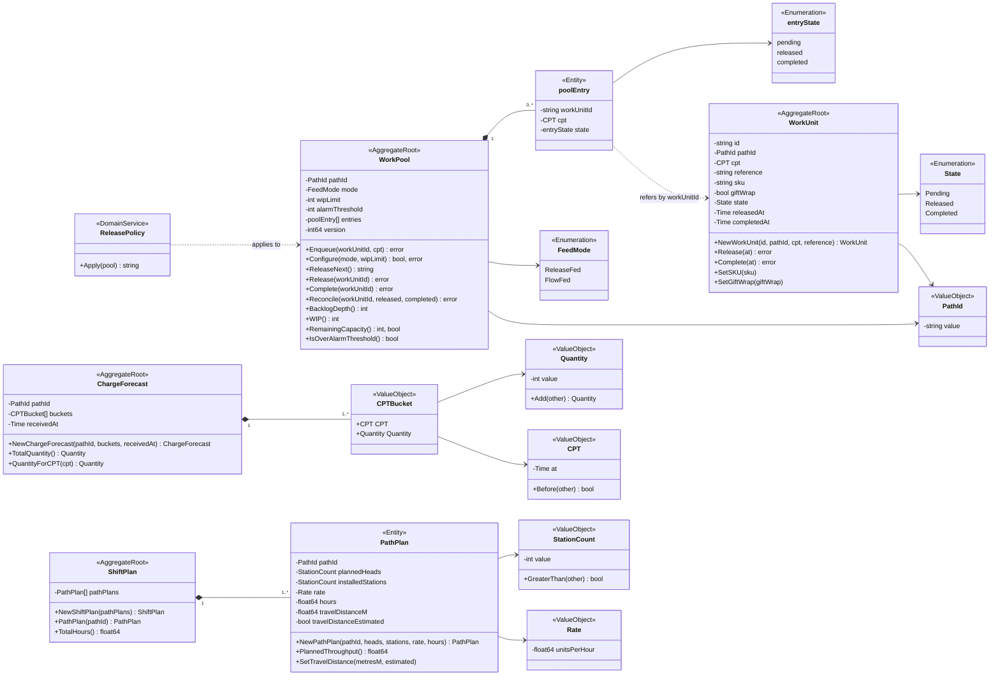
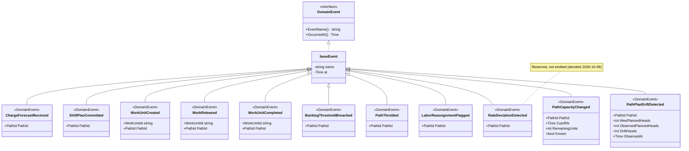
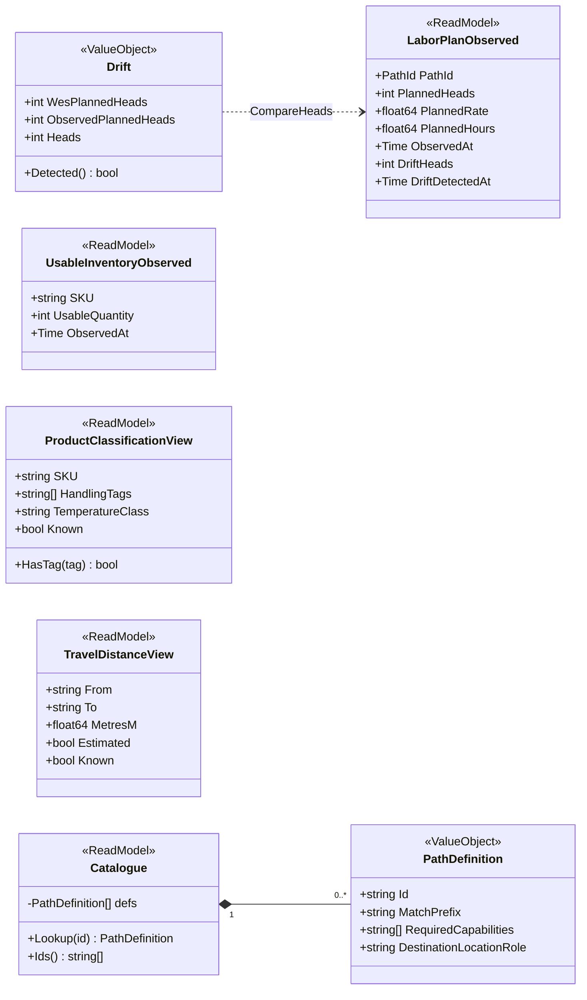
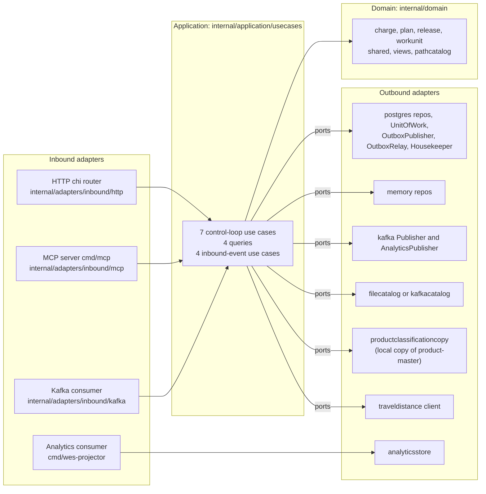

# UML class diagrams

Four diagrams, split so none exceeds about twenty classes: the aggregates and
value objects, the domain events, the read models, and the hexagon of ports
and adapters. Type and member names are the real Go identifiers; Go has no
visibility keyword for fields, so unexported fields are shown with `-` and
exported methods with `+`.

Stereotypes: `<<AggregateRoot>>`, `<<Entity>>`, `<<ValueObject>>`,
`<<Enumeration>>`, `<<DomainService>>`, `<<DomainEvent>>`, `<<ReadModel>>`,
`<<Repository>>` (an outbound port).

## 1. Aggregates and value objects

Source: `internal/domain/charge/forecast.go`, `internal/domain/plan/shift_plan.go`,
`internal/domain/plan/path_plan.go`, `internal/domain/release/work_pool.go`,
`internal/domain/release/release_policy.go`, `internal/domain/workunit/work_unit.go`,
`internal/domain/shared/*.go`. Omits: read-only accessors (`PathId()`,
`Mode()`, `Entries()`, ...), `RestoreEntry` / `SetVersion` (repository
rehydration only), `travelDistanceKnown`, and the `PathId` /
`CPT` associations of `ChargeForecast`, `PathPlan` and `poolEntry`.
`releasedAt` / `completedAt` are `*time.Time` (nil until the transition).

The association between `WorkPool` and `WorkUnit` is **by identity only**:
the pool's entries hold a work unit id, never a `WorkUnit`. They are two
aggregates with two consistency boundaries.

## 2. Domain events

Source: `internal/domain/shared/events.go`. Go has no inheritance: each event
**embeds** `baseEvent`, which is drawn as generalisation. Omits: the `New...`
constructors. `DriftHeads` is computed by the constructor as
`ObservedPlannedHeads - WesPlannedHeads`.

## 3. Read models and catalogue views

Source: `internal/domain/laborview/*.go`, `internal/domain/inventoryview/usable_inventory_observed.go`,
`internal/domain/productclassificationview/product_classification_view.go`,
`internal/domain/traveldistanceview/travel_distance_view.go`,
`internal/domain/pathcatalog/path_definition.go`. `DriftHeads` and
`DriftDetectedAt` are pointers (nil until a comparison was made). Omits:
`pathcatalog.ErrUnknownPath`, returned by `Lookup` on no prefix match.

## 4. Ports and adapters

The application layer owns the ports (`internal/application/ports`); adapters
implement them and `cmd/wes/main.go` wires one adapter per port.

```mermaid
classDiagram
    direction LR
    class ChargeRepo {
        <<Repository>>
        +Save(forecast)
        +FindByPathId(pathId)
    }
    class PlanRepo {
        <<Repository>>
        +Save(pathId, shiftPlan)
        +FindByPathId(pathId)
    }
    class WorkPoolRepo {
        <<Repository>>
        +Save(pool)
        +FindByPathId(pathId)
    }
    class WorkUnitRepo {
        <<Repository>>
        +Save(unit)
        +FindById(id)
        +FindByPathId(pathId)
        +FindByReference(reference)
    }
    class LaborPlanViewRepo {
        <<Repository>>
        +Save(view)
        +FindByPathId(pathId)
        +SaveDrift(pathId, driftHeads, detectedAt)
    }
    class InventoryViewRepo {
        <<Repository>>
        +ApplyDelta(sku, delta, observedAt)
        +FindBySKU(sku)
    }
    class ProcessedEventRepo {
        <<Repository>>
        +TryMarkProcessed(eventId, processedAt) bool
    }
    class EventPublisher {
        <<interface>>
        +Publish(events)
    }
    class UnitOfWork {
        <<interface>>
        +Execute(fn)
    }
    class PathCatalogue {
        <<interface>>
        +Lookup(id)
    }
    class ProductClassificationLookup {
        <<interface>>
        +GetClassification(sku)
    }
    class TravelDistanceLookup {
        <<interface>>
        +GetDistance(from, to)
    }
    class ReleaseMetrics {
        <<interface>>
        +WorkUnitReleased(pathId)
    }

    class PostgresRepos["postgres.*Repo"]
    class MemoryRepos["memory.*Repo"]
    class OutboxPublisher["postgres.OutboxPublisher"]
    class KafkaPublisher["kafka.Publisher"]
    class LogPublisher["events.LogPublisher"]
    class PgUnitOfWork["postgres.UnitOfWork"]
    class FileCatalogue["filecatalog"]
    class KafkaCatalogue["kafkacatalog.Consumer"]
    class ClassificationCopy["productclassificationcopy.Store"]
    class TravelClient["traveldistance.BreakerClient"]
    class OtelReleaseMetrics["telemetry release metrics"]

    PostgresRepos ..|> WorkPoolRepo
    PostgresRepos ..|> WorkUnitRepo
    PostgresRepos ..|> ChargeRepo
    PostgresRepos ..|> PlanRepo
    PostgresRepos ..|> LaborPlanViewRepo
    PostgresRepos ..|> InventoryViewRepo
    PostgresRepos ..|> ProcessedEventRepo
    MemoryRepos ..|> WorkPoolRepo
    MemoryRepos ..|> ProcessedEventRepo
    OutboxPublisher ..|> EventPublisher
    KafkaPublisher ..|> EventPublisher
    LogPublisher ..|> EventPublisher
    PgUnitOfWork ..|> UnitOfWork
    FileCatalogue ..|> PathCatalogue
    KafkaCatalogue ..|> PathCatalogue
    ClassificationCopy ..|> ProductClassificationLookup
    TravelClient ..|> TravelDistanceLookup
    OtelReleaseMetrics ..|> ReleaseMetrics
```

Source: `internal/application/ports/*.go`, `internal/adapters/**`,
`cmd/wes/main.go`, `cmd/mcp/main.go`, `cmd/wes-projector/main.go`,
`cmd/wes-reports/main.go`. Omits: `Clock` (`memory.SystemClock`), the
`ProcessedEventReleaser` optional port, the permissive / no-op variants of the
two REST lookups, `events.MultiPublisher`, and `cmd/wes-reports` (serves
`GET /reports/throughput` from `analyticsstore.PostgresReport`). The MCP
server calls the use cases in-process through its own composition root,
not over REST.
