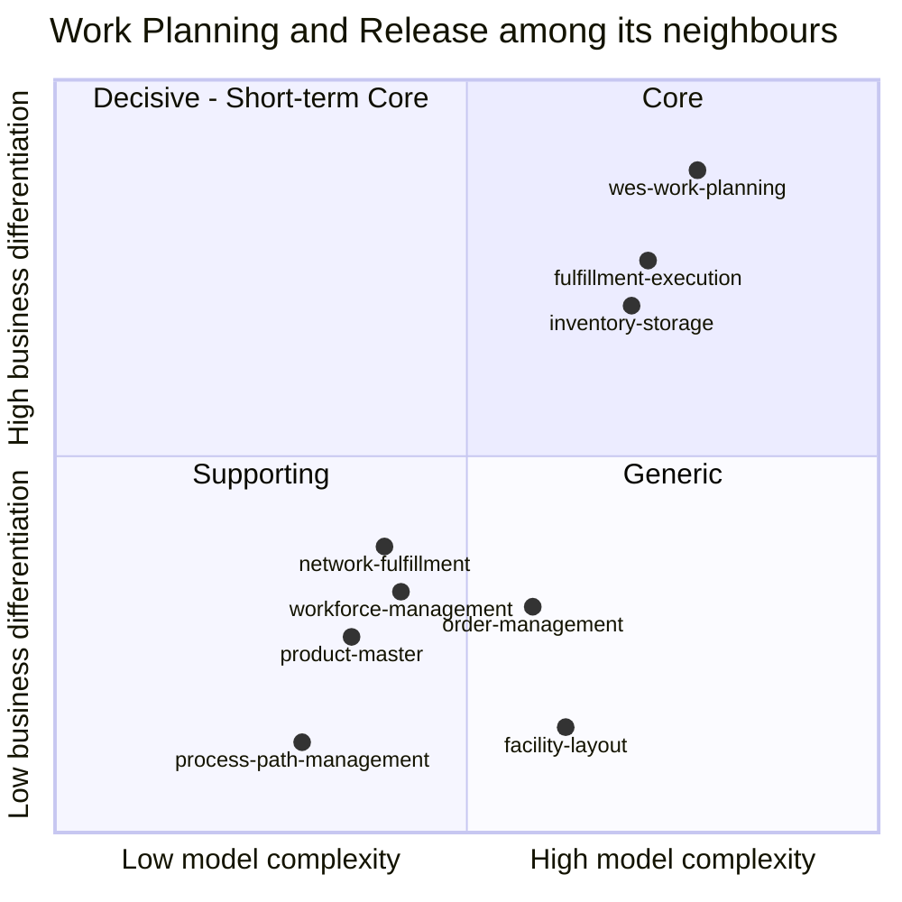

# Core domain chart

A [ddd-crew Core Domain Chart](https://github.com/ddd-crew/core-domain-charts)
for this bounded context, with the directly integrated siblings plotted for
contrast. **Business differentiation** is the y-axis, **model complexity**
the x-axis. The classification matches
[Subdomain classification](./subdomain-classification.md): this context is
**Core**.

Source: positions are a judgement call grounded in the evidence below and in
the classifications on [Subdomain classification](./subdomain-classification.md).
Omits: contexts with no edge to this one (labor-performance,
warehouse-planning, warehouse-ops-agent).

## Why this context sits top-right

**Business differentiation — high.** The release decision is where the
operation's speed is won or lost, and the platform builds it rather than
buying a vendor WES:

- the CPT priority function and waveless, one-at-a-time admission
  ([ADR-0002](../adr/0002-waveless-continuous-release.md));
- the WIP-limit backpressure that is a hard invariant on release-fed paths and
  only an alarm on flow-fed ones
  ([ADR-0003](../adr/0003-flow-balancing-as-domain-service.md));
- Drum-Buffer-Rope flow balancing with two levers (`ThrottleUpstream`,
  `ReassignLabor`);
- the published remaining-capacity signal other contexts promise against
  ([ADR-0018](../adr/0018-path-capacity-changed.md)).

**Model complexity — high, but concentrated.** Evidence from the code:

| Measure | Count | Where |
|---|---|---|
| Aggregate roots | 4 | `ChargeForecast`, `ShiftPlan`, `WorkPool`, `WorkUnit` |
| Enforced invariants | 20 on aggregates + 4 on value objects | [Aggregate design canvas](./aggregate-design-canvas.md) (C1–C3, P1–P4, W1–W8, U1–U5; `Rate`, `PathId`, `Quantity`, `StationCount`) |
| Domain events | 11 | `internal/domain/shared/events.go` |
| Inbound integration events handled | 11 types on 7 topics | `internal/adapters/kafka/cloudevents/cloudevents.go` (consumed-type constants), `internal/adapters/inbound/kafka/consumer.go`, `internal/adapters/inbound/kafka/product_classification_consumer.go`, `internal/adapters/outbound/kafkacatalog` |
| ADRs | 35 | [ADR index](../adr/index.md) |
| Concurrency concerns modelled | optimistic `version` on `WorkPool`, atomic processed-event mark, idempotency keys | ADR-0029, ADR-0028, ADR-0022 |

Most of the complexity sits in `WorkPool` (priority, feed modes, WIP,
reconciliation, concurrency). `ChargeForecast` and `ShiftPlan` are
comparatively simple.

## Evolution (Wardley stage)

| Component | Stage | Why |
|---|---|---|
| Release policy, WIP backpressure, flow balancing | **Custom-built** | Written and tuned here; the differentiator. Expected to keep changing (customer tiering, cold chain, aisle batching), which is why `ReleasePolicy` is a separate object. |
| Plan-vs-labor drift reconciliation (ADR-0019) | **Genesis → Custom** | Newest capability; the signal exists, nothing consumes it yet. |
| Process-path catalogue, travel distances, product classification | **Product** | Consumed from siblings (process-path-management and facility-layout, Generic; product-master, Supporting, through a local copy of its `ProductClassified` events — [ADR-0035](../adr/0035-product-classification-local-copy.md)), never re-modelled here. |
| Postgres, Kafka, CloudEvents, OpenTelemetry, transactional outbox | **Commodity** | Standard infrastructure behind ports. |

## What would move it

- Replacing the in-house release policy with a vendor WES behind an ACL would
  drop this context to **Supporting** — the conditional in the platform's
  strategic reference.
- If `ReleasePolicy` stays a one-line "earliest CPT first" for long, the
  differentiation claim weakens: today's priority function is simple, and the
  investment is in the model around it rather than in the rule itself.
