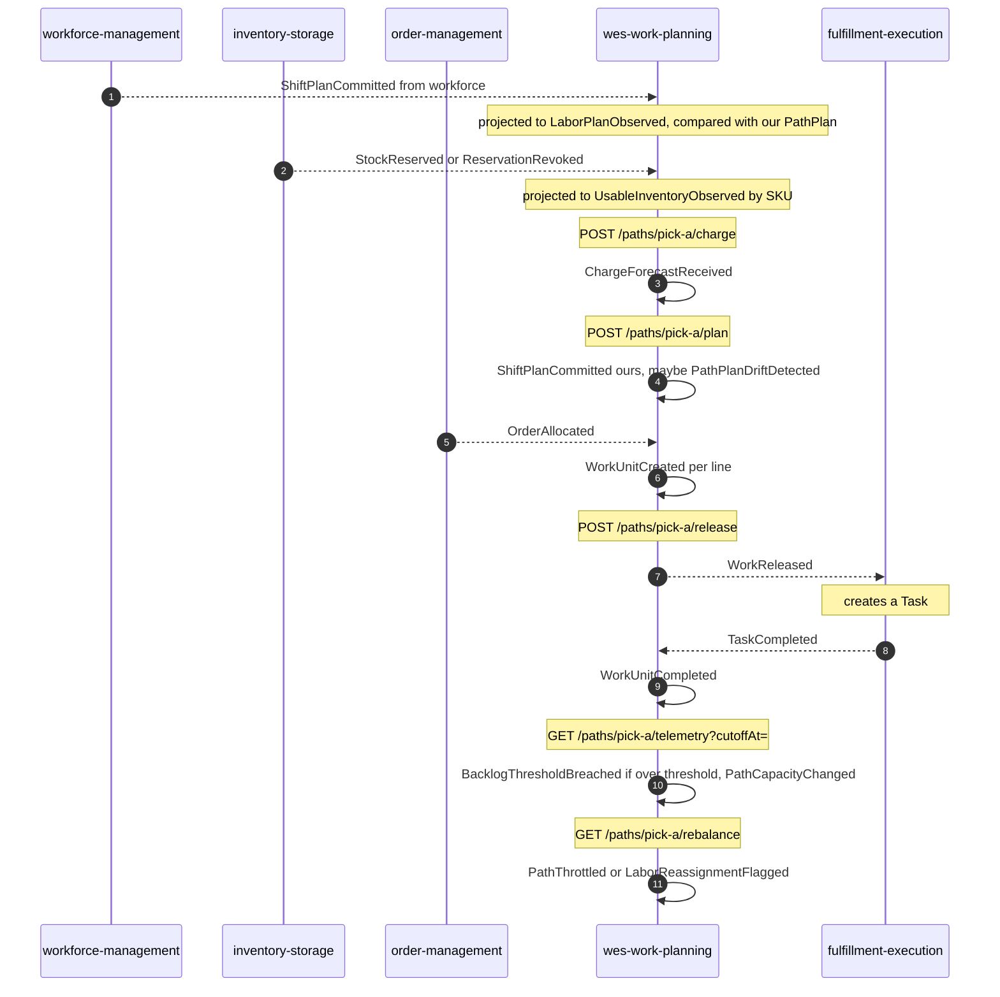

# Domain events

Eleven past-tense domain events are declared in
`internal/domain/shared/events.go`. All implement one interface:

```go
type DomainEvent interface {
    EventName() string
    OccurredAt() time.Time
}
```

`OccurredAt` comes from the injected `Clock` port, never from `time.Now()`
inside the domain, so every event assertion in the test suite is exact.

## Published

All eleven go to **`warehouse.work-planning.events`** (and a copy of each to
`warehouse.wes.analytics` for this service's own analytics projector) as
CloudEvents 1.0 structured-mode JSON. The Kafka **partition key** is the
CloudEvents `subject`: the **work unit id** for `workunit` events, the
**path id** for every other event
([ADR-0024](../adr/0024-kafka-hash-balancer-partition-affinity.md)).
`dataschema` is `urn:warehouse:wes-work-planning:events:<EventName>:v1`
(`:analytics:` on the analytics topic).

| Full CloudEvents type | Key / subject | `data` fields | Raised by | Known consumers |
|---|---|---|---|---|
| `com.warehouse.wes.work-planning.charge.ChargeForecastReceived` | path id | `path_id` | `ReceiveChargeForecast` | — |
| `com.warehouse.wes.work-planning.plan.ShiftPlanCommitted` | path id | `path_id` | `CommitShiftPlan` | — |
| `com.warehouse.wes.work-planning.workunit.WorkUnitCreated` | work unit id | `path_id`, `work_unit_id` | `EnqueueWorkUnit` (REST or `ApplyOrderAllocated`) | — |
| **`com.warehouse.wes.work-planning.workunit.WorkReleased`** | work unit id | `path_id`, `work_unit_id`, `cpt`, `ref`, optional `required_capabilities`, `fragile`, `gift_wrap`, `line_no` ([ADR-0036](../adr/0036-work-unit-line-no-on-work-released.md)) | `ReleaseNextWork` (REST or MCP) | **fulfillment-execution** — `internal/adapters/inbound/kafka/consumer.go` turns it into a `Task` |
| `com.warehouse.wes.work-planning.workunit.WorkUnitCompleted` | work unit id | `path_id`, `work_unit_id` | `RecordCompletion` (REST or `ApplyTaskCompleted`) | — |
| `com.warehouse.wes.work-planning.workpool.BacklogThresholdBreached` | path id | `path_id` | `SampleBacklog` when backlog depth exceeds the alarm threshold | — |
| `com.warehouse.wes.work-planning.workpool.RateDeviationDetected` | path id | `path_id` | **nothing** — reserved for a future detection rule, not emitted (decided 2026-10-06: kept) | — |
| `com.warehouse.wes.work-planning.workpool.PathThrottled` | path id | `path_id` | `RebalanceDecision`, flow-fed pool over threshold | — |
| `com.warehouse.wes.work-planning.workpool.LaborReassignmentFlagged` | path id | `path_id` | `RebalanceDecision`, release-fed pool at WIP limit with backlog | — |
| **`com.warehouse.wes.work-planning.workpool.PathCapacityChanged`** | path id | `path_id`, `cutoff_at`, `remaining_units`, `known` | `SampleBacklog`, only when `cutoffAt` is supplied ([ADR-0018](../adr/0018-path-capacity-changed.md)) | **order-management** — `internal/adapters/outbound/kafkapathcapacity/consumer.go`; **network-fulfillment** — `internal/adapters/outbound/pathcapacitycache/consumer.go` |
| `com.warehouse.wes.work-planning.pathplan.PathPlanDriftDetected` | path id | `path_id`, `wes_planned_heads`, `observed_planned_heads`, `drift_heads`, `observed_at` | `CommitShiftPlan` or `ObserveLaborPlan`, whichever commits second ([ADR-0019](../adr/0019-labor-plan-committed-shift-plan-reconciliation.md)) | — |

Every event also reaches `cmd/wes-projector` via `warehouse.wes.analytics`
(consumer group `wes-analytics`); five of them move the
[release throughput report](../analytics/release-throughput-report.md).

Source of the table: `internal/domain/shared/events.go`,
`internal/adapters/outbound/kafka/publisher.go` (`eventTypeEntity`,
`subjectFor`, `dataFor`), `apis/asyncapi.yaml`, and `git grep` of each
sibling's `origin/develop`.

:::caution[Stated honestly]
`RateDeviationDetected` is declared in the domain, in `apis/asyncapi.yaml`
and in the analytics rollup, but no use case raises it — computing rate
deviation needs a time-windowed actual-rate projection that is not built.
**Decided 2026-10-06: kept reserved.** It is declared for a future detection
rule ([ADR-0020](../adr/0020-flowfed-path-observed-throughput-signal.md) defers
it), is not emitted today, and is not removed (removing a declared message would
be a contract removal).

Kafka publication is **opt-in at runtime** via `EVENT_PUBLISHER=kafka`. With
the default `EVENT_PUBLISHER=log`, every event above goes to the log
publisher instead.
:::

## Consumed

Consumer group `wes-work-planning` (override with `KAFKA_CONSUMER_GROUP`),
dispatching on the **full** `type`; unknown types are ignored; a non-CloudEvents
message goes straight to `<topic>.dlq`; a handler error is tried 3 times in
total (exponential backoff) and then dead-lettered. Each handler marks the CloudEvents `id` in
`processed_events` atomically with its effect
([ADR-0028](../adr/0028-processed-event-mark-atomic-with-handling.md)).

| Topic | Full CloudEvents type | Producer | Handled by |
|---|---|---|---|
| `warehouse.workforce.events` | `com.warehouse.wes.workforce-management.shiftplan.ShiftPlanCommitted` | workforce-management | `ObserveLaborPlan` → `LaborPlanObserved` + drift |
| `warehouse.inventory.events` | `com.warehouse.wms.inventory-storage.reservation.StockReserved` | inventory-storage | `ObserveInventoryChange`, delta −quantity |
| `warehouse.inventory.events` | `com.warehouse.wms.inventory-storage.reservation.ReservationRevoked` | inventory-storage | `ObserveInventoryChange`, delta +quantity |
| `warehouse.fulfillment.events` | `com.warehouse.wes.fulfillment-execution.task.TaskCompleted` | fulfillment-execution | `ApplyTaskCompleted` → `RecordCompletion` |
| `warehouse.order-management.events` | `com.warehouse.wes.order-management.order.OrderAllocated` | order-management | `ApplyOrderAllocated` → `EnqueueWorkUnit` per line |
| `warehouse.order-management.events` | `com.warehouse.wes.order-management.order.OrderPartiallyAllocated` | order-management | same |
| `warehouse.process-path-management.events` | `com.warehouse.wes.process-path-management.processpath.ProcessPathCreated` / `ProcessPathUpdated` / `ProcessPathDeactivated` | process-path-management | `kafkacatalog.Consumer` (process-unique group, replays from earliest), only with `PATH_CATALOGUE_SOURCE=kafka` |

## Event flow through a shift



Source: the use cases in `internal/application/usecases/`. Omits: MCP entry
points and analytics fan-out. The two `ShiftPlanCommitted` events are
**different events from different contexts** that share a name
([ADR-0006](../adr/0006-labor-plan-view-not-shift-plan.md)).

## Why events carry so little

Most events carry only a `path_id`: a domain event is a *fact that something
happened*, and the smallest payload that identifies the subject keeps
consumers from treating the stream as data replication.

The exceptions are deliberate. `WorkReleased` is enriched **in the adapter**
with `cpt`, `ref`, `gift_wrap`, `line_no` and classification hints so fulfillment-execution
can build a `Task` without calling back. `PathCapacityChanged` and
`PathPlanDriftDetected` are *reports*, so they carry the figures they report.

## Wire format

Envelope, headers and examples: [Events](../api/events.md) and
`.claude/rules/cloudevents-envelope.md`
([ADR-0027](../adr/0027-cloudevents-mandatory-event-envelope.md)).
