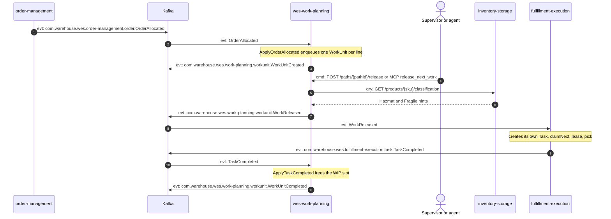
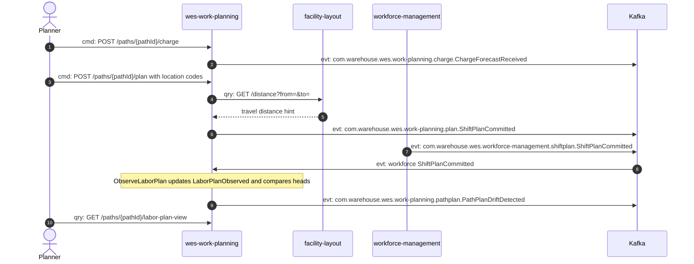
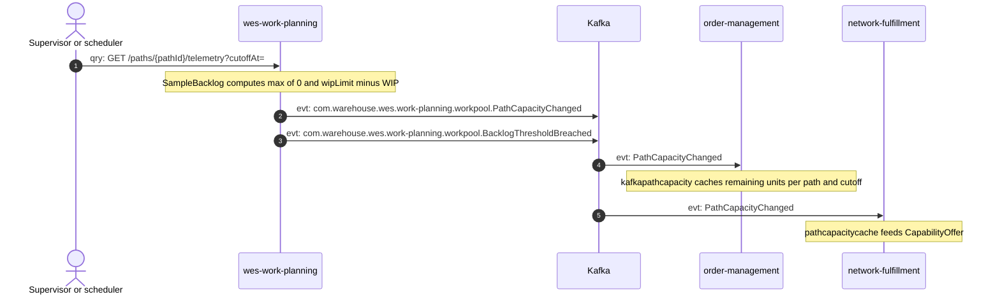
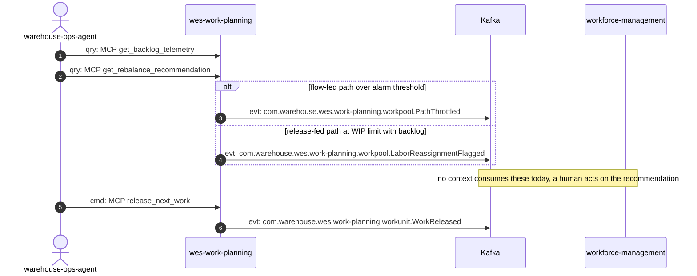

# Domain message flow

[ddd-crew Domain Message Flow Modelling](https://github.com/ddd-crew/domain-message-flow-modelling)
for four business scenarios. Participants are people, bounded contexts and
the broker; every arrow is a real message, prefixed `cmd:` (command),
`evt:` (event) or `qry:` (query) and numbered.

Event types are written in full the first time and shortened to their last
segment afterwards inside the same diagram.

## Scenario 1 — An allocated order becomes released, picked and completed work

Source: `internal/application/usecases/apply_order_allocated.go`,
`release_next_work.go`, `apply_task_completed.go`,
`internal/adapters/outbound/kafka/publisher.go`. Omits: the analytics copy of
every event on `warehouse.wes.analytics`, and REST enqueue
(`POST /paths/{pathId}/work-units`), which is an alternative to step 1.

## Scenario 2 — Planning a shift and detecting plan-vs-labor drift

Source: `internal/application/usecases/receive_charge_forecast.go`,
`commit_shift_plan.go`, `observe_labor_plan.go`,
`drift_reconciliation.go`. Omits: the opposite order (Workforce commits
first, then `CommitShiftPlan` raises the drift event) and the no-drift case,
which raises nothing. The two `ShiftPlanCommitted` types are different events
from different contexts ([ADR-0006](../adr/0006-labor-plan-view-not-shift-plan.md)).

## Scenario 3 — Publishing remaining path capacity for promising

Source: `internal/application/usecases/sample_backlog.go`;
order-management `internal/adapters/outbound/kafkapathcapacity/consumer.go`;
network-fulfillment `internal/adapters/outbound/pathcapacitycache/consumer.go`
(both on `origin/develop`). Omits: `BacklogThresholdBreached` is raised only
when the backlog exceeds the alarm threshold.

## Scenario 4 — Flow balancing driven by an agent

Source: `internal/adapters/inbound/mcp/tools.go`,
`internal/application/usecases/rebalance_decision.go`; warehouse-ops-agent
`internal/config/config.go` allow-lists the two read tools. Omits: the
`balance_flow` MCP prompt and the `telemetry://{pathId}/backlog` resource.
