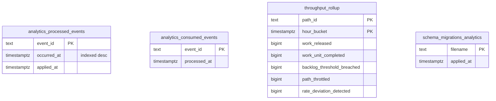

# Entity-relationship diagram

The schema below is the **final state** after applying `migrations/0001` to
`migrations/0010` in order (golang-migrate, run on start-up by
`cmd/wes` when `DATABASE_URL` is set, over `MIGRATIONS_DATABASE_URL` if given —
[ADR-0026](../adr/0026-migrations-direct-postgres-connection.md)), plus the
separate **analytical** database built from `migrations/analytics/`.

Without `DATABASE_URL` the service runs on in-memory repositories
(`internal/adapters/outbound/memory`) and none of these tables exist.

## OLTP database

```mermaid
erDiagram
    work_pools ||--o{ work_pool_entries : "has entries, ON DELETE CASCADE"

    charge_forecasts {
        text path_id PK
        timestamptz received_at
        jsonb buckets "array of cpt and quantity"
    }
    shift_plans {
        text path_id PK
        integer planned_heads
        integer installed_stations
        double_precision rate_units_per_hr
        double_precision hours
        double_precision travel_distance_m "nullable, 0010"
        boolean travel_distance_estimated "nullable, 0010"
    }
    work_pools {
        text path_id PK
        text mode "ReleaseFed or FlowFed"
        integer wip_limit
        integer alarm_threshold
        bigint version "optimistic concurrency, 0007"
    }
    work_pool_entries {
        text path_id PK,FK
        text work_unit_id PK
        timestamptz cpt
        text state "pending, released, completed"
    }
    work_units {
        text id PK
        text path_id "indexed"
        timestamptz cpt
        text reference "indexed, 0004"
        text state
        timestamptz released_at
        timestamptz completed_at
        text sku "0003"
        boolean gift_wrap "0008"
    }
    labor_plan_view {
        text path_id PK
        integer planned_heads
        double_precision planned_rate
        double_precision planned_hours
        timestamptz observed_at
        integer drift_heads "nullable, 0009"
        timestamptz drift_detected_at "nullable, 0009"
    }
    usable_inventory_view {
        text sku PK
        integer usable_quantity
        timestamptz observed_at
    }
    processed_events {
        text event_id PK
        timestamptz processed_at
    }
    outbox_events {
        bigserial id PK
        text topic
        text event_type
        bytea key
        bytea value
        jsonb headers
        timestamptz created_at
        timestamptz published_at "partial index where NULL"
        integer attempts
        text last_error
    }
    idempotency_keys {
        text key PK
        text method
        text path
        text request_hash
        integer status_code
        bytea response_body
        jsonb response_headers
        timestamptz created_at "indexed"
        timestamptz completed_at
    }
    events {
        bigserial id PK
        text event_name
        timestamptz occurred_at
        jsonb payload
    }
```

Source: `migrations/0001_init.up.sql` to `migrations/0010_shift_plan_travel_distance.up.sql`.
Omits: golang-migrate's own `schema_migrations` bookkeeping table, column
defaults and `NOT NULL` flags (every column above is `NOT NULL` except
`released_at`, `completed_at`, `drift_heads`, `drift_detected_at`,
`travel_distance_m`, `travel_distance_estimated`, `key`,
`published_at`, `last_error` and the idempotency outcome columns).

**The only foreign key in the schema** is
`work_pool_entries.path_id → work_pools.path_id`. Everything else is linked
logically, by value, with no constraint — on purpose:

- `work_pool_entries.work_unit_id` ↔ `work_units.id` — two aggregates
  (`WorkPool`, `WorkUnit`) referenced by identity. A foreign key would couple
  their consistency boundaries; the use cases keep them aligned inside one
  transaction, and `WorkPool.Reconcile` heals a stale entry.
- `work_units.path_id`, `shift_plans.path_id`, `charge_forecasts.path_id`,
  `labor_plan_view.path_id` ↔ `work_pools.path_id` — each is a separate
  aggregate or projection keyed by the same process-path id, whose catalogue
  is owned by process-path-management.
- `usable_inventory_view.sku` ↔ `work_units.sku` — different contexts' keys;
  inventory-storage owns the SKU.

## Analytics database

A separate database (`ANALYTICS_DATABASE_URL`), written only by
`cmd/wes-projector` and read only by `cmd/wes-reports`
([ADR-0011](../adr/0011-analytical-data-product.md)).

Source: `migrations/analytics/0001_report.up.sql`,
`internal/adapters/outbound/analyticsstore/migrate.go`. No foreign keys.
`schema_migrations_analytics` is the bookkeeping table of the projector's own
migrator (`CREATE TABLE IF NOT EXISTS` in `migrate.go`), not a migration file.

## Table ≠ aggregate

| Table | What it is | Owner in code |
|---|---|---|
| `charge_forecasts` | `ChargeForecast` aggregate (buckets as JSONB) | `postgres.ChargeRepo` |
| `shift_plans` | `ShiftPlan` aggregate, one `PathPlan` row per path | `postgres.PlanRepo` |
| `work_pools` + `work_pool_entries` | `WorkPool` aggregate root + its entries | `postgres.WorkPoolRepo` (rewrites every entry on save, guarded by `version`; the `work_pools` row's `mode` / `wip_limit` are set by `ConfigurePool`, [ADR-0033](../adr/0033-configure-pool-command.md), or seeded `ReleaseFed`/1000 by the first enqueue) |
| `work_units` | `WorkUnit` aggregate | `postgres.WorkUnitRepo` |
| `labor_plan_view` | **Read model** `LaborPlanObserved` + ADR-0019 drift | `postgres.LaborPlanViewRepo` |
| `usable_inventory_view` | **Read model** `UsableInventoryObserved` | `postgres.InventoryViewRepo` |
| `processed_events` | **Infrastructure**: consumer inbox / dedupe on CloudEvents `id` ([ADR-0028](../adr/0028-processed-event-mark-atomic-with-handling.md)) | `postgres.ProcessedEventRepo` |
| `outbox_events` | **Infrastructure**: transactional outbox, one row per topic per event ([ADR-0014](../adr/0014-transactional-outbox.md)); published rows swept after `OUTBOX_RETENTION` | `postgres.OutboxPublisher`, `postgres.OutboxRelay` |
| `idempotency_keys` | **Infrastructure**: `Idempotency-Key` replay store ([ADR-0022](../adr/0022-idempotency-key-middleware.md)); swept after `IDEMPOTENCY_KEY_TTL` | `RequireIdempotencyKey`, `postgres` housekeeper |
| `events` | **Legacy, unused**: created by `0001_init`, no code reads or writes it. Decided 2026-10-06: retained, additive migrations only (never dropped without explicit approval) | — |
| `throughput_rollup` | **Analytics projection** (not a source of truth) | `analyticsstore.PostgresProjection` / `PostgresReport` |
| `analytics_processed_events`, `analytics_consumed_events` | **Infrastructure**: analytics idempotency layers | `analyticsstore` |

`travelDistanceM` / `travelDistanceEstimated` on `PathPlan` (the optional
ADR-0017 hint) are stored in the nullable `shift_plans.travel_distance_m` /
`travel_distance_estimated` columns (migration `0010`); `NULL`
`travel_distance_m` means no hint was recorded.
