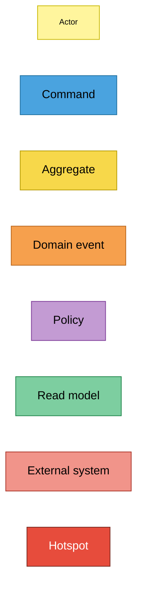
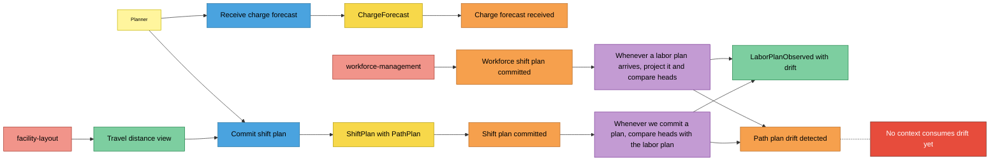
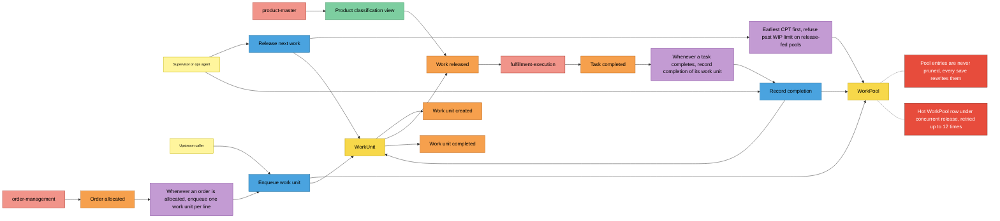
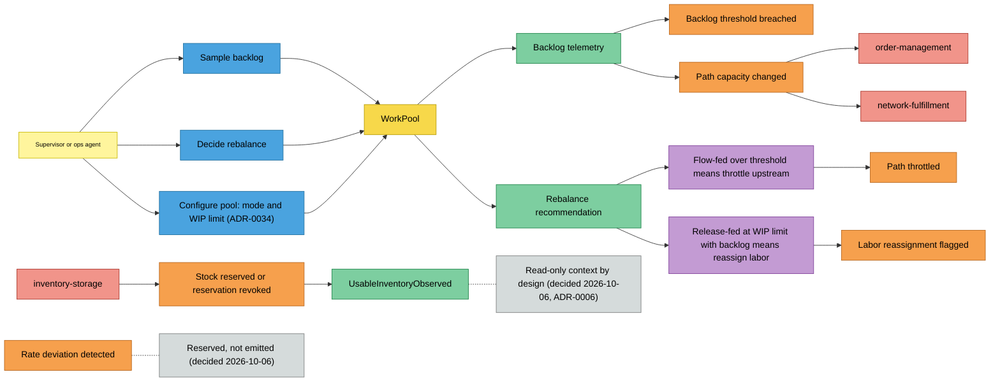

# EventStorming

Design-level EventStorming in the notation of the ddd-crew
[EventStorming glossary and cheat sheet](https://github.com/ddd-crew/eventstorming-glossary-cheat-sheet),
reconstructed from the code rather than from a workshop. Three processes: plan
the shift, run the release loop, and observe and correct.

## Legend

## Process 1 — Plan the shift

Source: `internal/application/usecases/receive_charge_forecast.go`,
`commit_shift_plan.go`, `observe_labor_plan.go`, `drift_reconciliation.go`,
`internal/domain/plan/*.go`, `internal/domain/laborview/*.go`. Omits:
validation failures (`ErrHeadsExceedStations`, `ErrNoBuckets`).

## Process 2 — The release loop

Source: `internal/application/usecases/apply_order_allocated.go`,
`enqueue_work_unit.go`, `release_next_work.go`, `record_completion.go`,
`apply_task_completed.go`, `pool_retry.go`,
`internal/domain/release/*.go`, `internal/domain/workunit/*.go`,
`internal/adapters/outbound/postgres/work_pool_repo.go`. Omits: the
idempotency layers (`Idempotency-Key`, processed-event mark) and the
stale-entry reconciliation inside release.

## Process 3 — Observe and correct

Source: `internal/application/usecases/sample_backlog.go`,
`rebalance_decision.go`, `configure_pool.go`, `observe_inventory_change.go`,
`internal/domain/shared/events.go`. Omits: `PathCapacityChanged` is raised only
when `cutoffAt` is supplied, and `BacklogThresholdBreached` only over the
alarm threshold. `Configure pool` raises no event
([ADR-0034](../adr/0034-configure-pool-command.md)).

## Stickies and their evidence

| Sticky | Kind | Evidence |
|---|---|---|
| Planner, Supervisor or ops agent, Upstream caller | Actor | REST callers of `internal/adapters/inbound/http/router.go`; MCP host of `internal/adapters/inbound/mcp/tools.go` |
| Receive charge forecast | Command | `usecases.ReceiveChargeForecast`, `POST /paths/{pathId}/charge` |
| Commit shift plan | Command | `usecases.CommitShiftPlan`, `POST /paths/{pathId}/plan` |
| Enqueue work unit | Command | `usecases.EnqueueWorkUnit`, `POST /paths/{pathId}/work-units` |
| Release next work | Command | `usecases.ReleaseNextWork`, `POST /paths/{pathId}/release`, MCP `release_next_work` |
| Record completion | Command | `usecases.RecordCompletion`, `POST /work-units/{id}/complete` |
| Sample backlog | Command (query that can emit events) | `usecases.SampleBacklog`, `GET /paths/{pathId}/telemetry` |
| Decide rebalance | Command (query that can emit events) | `usecases.RebalanceDecision`, `GET /paths/{pathId}/rebalance` |
| Configure pool | Command | `usecases.ConfigurePool`, `PUT /paths/{pathId}/pool` ([ADR-0034](../adr/0034-configure-pool-command.md)); raises no event |
| ChargeForecast, ShiftPlan, WorkPool, WorkUnit | Aggregate | `internal/domain/{charge,plan,release,workunit}` |
| Charge forecast received … Path plan drift detected (11) | Domain event | `internal/domain/shared/events.go` |
| Workforce shift plan committed, Order allocated, Task completed, Stock reserved | Domain event (external) | type constants in `internal/adapters/kafka/cloudevents/cloudevents.go` |
| Project labor plan and compare heads | Policy | `usecases.ObserveLaborPlan`, `reconcileHeads` |
| Compare heads on commit | Policy | `CommitShiftPlan.reconcileDrift` |
| Enqueue one work unit per line | Policy | `usecases.ApplyOrderAllocated` |
| Earliest CPT first, WIP limit | Policy | `release.ReleasePolicy`, `WorkPool.nextPendingIndex`, `ErrWIPLimitReached` |
| Record completion of its work unit | Policy | `usecases.ApplyTaskCompleted` |
| Throttle upstream, reassign labor | Policy | `usecases.RebalanceDecision` switch on `pool.Mode()` |
| LaborPlanObserved, UsableInventoryObserved | Read model | `internal/domain/laborview`, `internal/domain/inventoryview` |
| Backlog telemetry, Rebalance recommendation | Read model | `usecases.BacklogSnapshot`, `usecases.RebalanceRecommendation` |
| Product classification view, Travel distance view | Read model | `internal/domain/productclassificationview`, `internal/domain/traveldistanceview` |
| workforce-management, order-management, inventory-storage, product-master, fulfillment-execution, facility-layout, network-fulfillment | External system | topics and REST clients listed on the [Bounded context canvas](./bounded-context-canvas.md) |

## Hotspots

Each hotspot is a known gap visible in code or ADRs, not a guess. Rows marked
**Decided** or **Resolved** record the 2026-10-06 decision so the question does
not resurface.

| Hotspot | Evidence |
|---|---|
| `PathPlanDriftDetected` has no consumer | No sibling references the type; [ADR-0019](../adr/0019-labor-plan-committed-shift-plan-reconciliation.md) reports drift, it does not correct it |
| `WorkPool` entries are never pruned and every save rewrites them | `WorkPoolRepo.Save` deletes and re-inserts all `work_pool_entries` for the path |
| Hot `WorkPool` row under concurrent writes | [ADR-0029](../adr/0029-work-pool-optimistic-concurrency.md); `maxPoolSaveAttempts = 12`, then 409 `concurrent-modification` |
| `RateDeviationDetected` is declared but never raised | **Decided 2026-10-06: kept reserved.** Declared for a future detection rule ([ADR-0020](../adr/0020-flowfed-path-observed-throughput-signal.md) defers it); not emitted today. Detection needs a business rule nobody has specified, and removing the declaration would be a contract removal |
| ~~No code path creates a flow-fed pool or changes WIP limits~~ | **Resolved 2026-10-06 (ADR-0034):** `PUT /paths/{pathId}/pool` (`usecases.ConfigurePool`) sets a path's mode and WIP limit, creating the pool if absent; lowering below the current WIP never evicts, releases pause until WIP < limit. An unconfigured path keeps the `ReleaseFed` / 1000 fallback of `EnqueueWorkUnit` |
| `UsableInventoryObserved` feeds no decision | **Decided 2026-10-06: read-only context by design ([ADR-0006](../adr/0006-labor-plan-view-not-shift-plan.md)); gating release on it would be a new business rule.** Reservations in inventory-storage already guard availability. Only `ObserveInventoryChange` writes it and only `InventoryView` (`GET /inventory-view/{sku}`) reads it |
| `events` table is unused | **Decided 2026-10-06: legacy, unused; retained, additive migrations only.** Dropping it is destructive and needs explicit approval |
