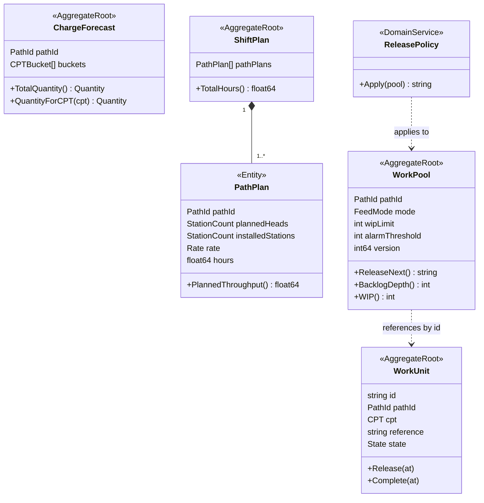

# Domain-Driven Design

This section is the tactical and strategic DDD record for the **Work Planning &
Release** bounded context. Everything here is derived from the platform's
strategic reference documents and from this repository's own code — no
aspirational modelling.

| Page | Contents |
|---|---|
| [Subdomain classification](/docs/ddd/subdomain-classification) | Core / Supporting / Generic, with the justification |
| [DDD artifacts (ddd-crew)](/docs/ddd/ddd-artifacts) | The artifact pack: core domain chart, bounded context canvas, context map, aggregate design canvas, domain message flow, EventStorming, ubiquitous language, UML class, ER and sequence diagrams |
| [Aggregate design canvas](/docs/ddd/aggregate-design-canvas) | All four aggregates, every invariant, every failing path |
| [Domain events](/docs/ddd/domain-events) | The eleven events published, and every event consumed |
| [Read models](/docs/ddd/read-models) | Projections — and why they are never aggregate state |
| [Context relationships](/docs/ddd/context-relationships) | Customer/Supplier, ACL, OHS, Conformist — the strategic patterns |

## One-page summary

Source: `internal/domain/{charge,plan,release,workunit}`. Omits: value
objects, events and read models — see [Class diagrams](/docs/ddd/class-diagram).

Note the association style between `WorkPool` and `WorkUnit`: the pool holds
**entry records keyed by work unit id**, not `WorkUnit` objects. They are two
separate aggregates with two separate consistency boundaries, referenced by
identity — updated in the same use case and the same transaction, but each
guarding its own invariants.
