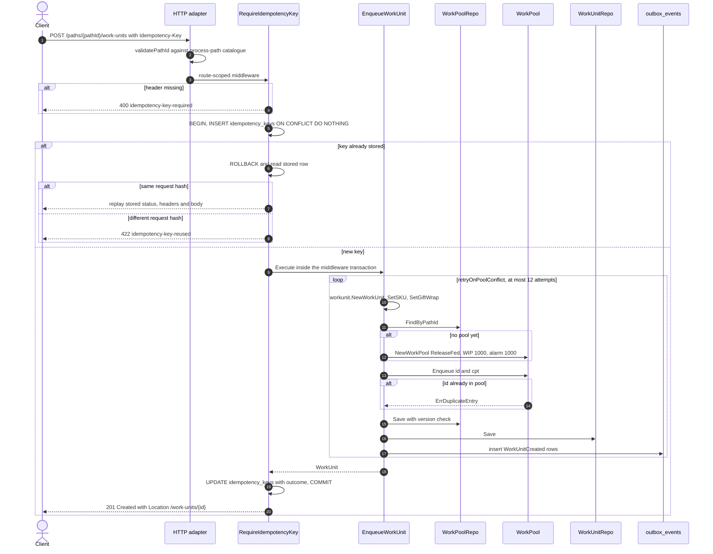
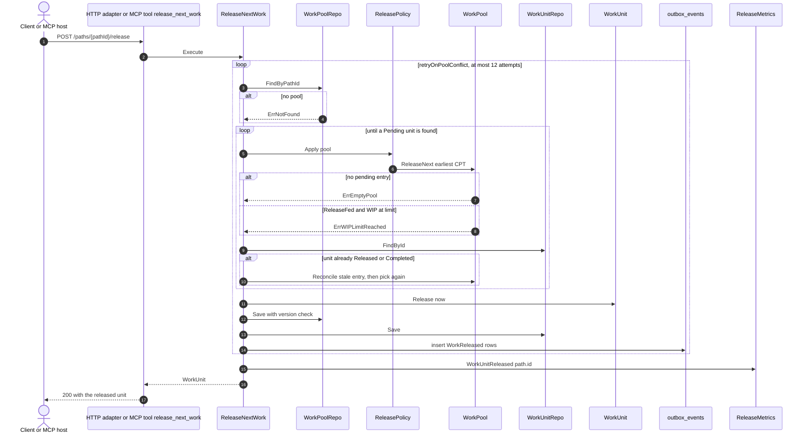
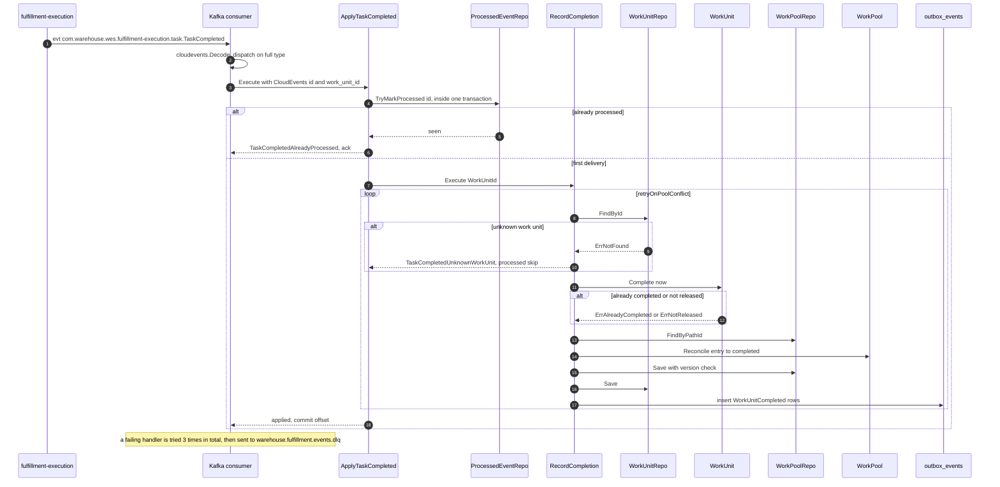
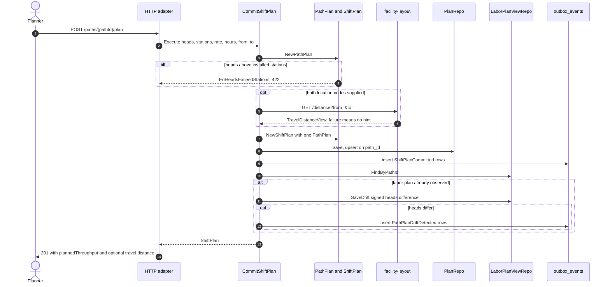
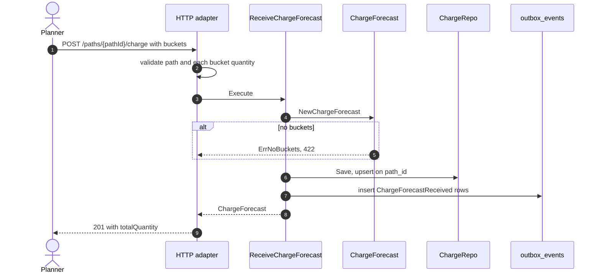
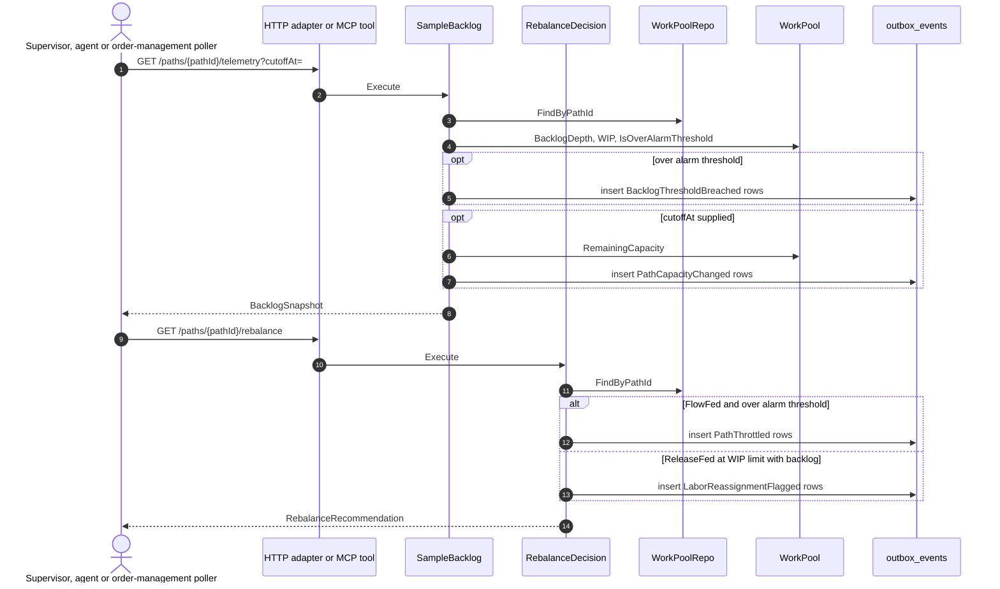
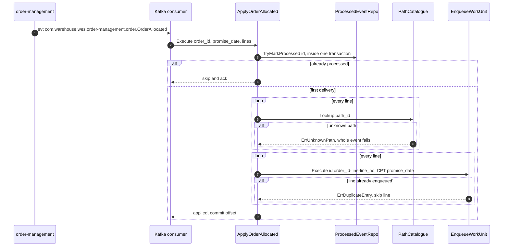
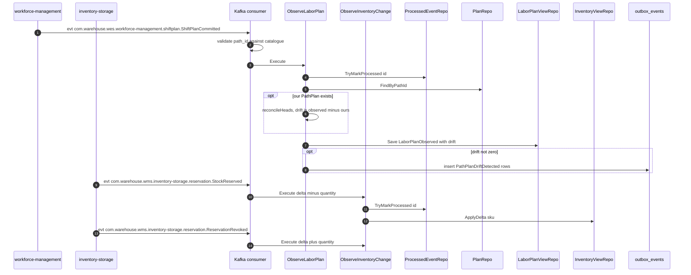
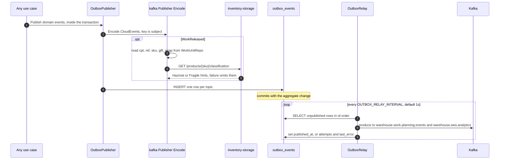

# Sequence diagrams

UML sequence diagrams for every command use case this context exposes, traced
from the function bodies in `internal/application/usecases/` and the inbound
adapters. Participants follow the hexagon: client → inbound adapter →
application service (use case) → aggregate → repository / outbox → broker.

Conventions used throughout:

- **Postgres mode** is drawn (`DATABASE_URL` set). In in-memory mode
  `UnitOfWork` is nil, `atomically` just calls the function, and there is no
  outbox — the `EventPublisher` is the log or Kafka publisher directly.
- `atomically(...)` is one Postgres transaction: aggregate rows **and** the
  outbox rows commit or roll back together
  ([ADR-0014](../adr/0014-transactional-outbox.md)). Each domain event becomes
  two outbox rows: `warehouse.work-planning.events` and
  `warehouse.wes.analytics`.
- `retryOnPoolConflict` re-runs the whole load-mutate-save attempt when
  `WorkPoolRepo.Save` reports `ports.ErrConcurrentModification` — up to 12
  attempts with jittered backoff (2 ms doubling, capped at 100 ms)
  ([ADR-0029](../adr/0029-work-pool-optimistic-concurrency.md)).

## 1. Enqueue a work unit over REST (with `Idempotency-Key`)

Source: `internal/adapters/inbound/http/router.go`,
`internal/adapters/inbound/http/idempotency.go`,
`internal/adapters/inbound/http/handlers.go` (`postWorkUnit`),
`internal/application/usecases/enqueue_work_unit.go`,
`internal/application/usecases/pool_retry.go`,
`internal/adapters/outbound/postgres/work_pool_repo.go`. Omits: the
in-memory route (no middleware), the 400 `malformed-request-body` and
`unknown-path-id` branches before the middleware, and a handler panic (rolls
back, never cached).

## 2. Release the next work unit (REST or MCP)

Source: `internal/application/usecases/release_next_work.go`,
`internal/domain/release/release_policy.go`,
`internal/domain/release/work_pool.go`,
`internal/adapters/inbound/mcp/tools.go`. Omits: the error-to-problem
mapping (`errors.go`) and the `WorkReleased` payload enrichment, which
happens when the outbox row is encoded (diagram 8).

## 3. Record a completion (REST or `TaskCompleted`)

`POST /work-units/{id}/complete` calls the same `RecordCompletion.Execute`
directly, without the processed-event mark.

Source: `internal/adapters/inbound/kafka/consumer.go`,
`internal/application/usecases/apply_task_completed.go`,
`internal/application/usecases/apply_integration_event.go`,
`internal/application/usecases/record_completion.go`. Omits: the in-memory
`ReleaseProcessed` path that undoes the mark on failure when there is no
transaction.

## 4. Commit a shift plan (travel hint and drift reconciliation)

Source: `internal/application/usecases/commit_shift_plan.go`,
`internal/application/usecases/drift_reconciliation.go`,
`internal/domain/plan/path_plan.go`,
`internal/adapters/outbound/traveldistance/`. Omits: the circuit breaker and
retry around the facility-layout call (ADR-0023) and
`TRAVEL_DISTANCE_MODE=permissive`, which never calls out.

## 5. Receive a charge forecast

Source: `internal/application/usecases/receive_charge_forecast.go`,
`internal/domain/charge/forecast.go`,
`internal/adapters/inbound/http/handlers.go` (`postChargeForecast`).

## 6. Sample backlog and decide a rebalance (REST or MCP)

Source: `internal/application/usecases/sample_backlog.go`,
`internal/application/usecases/rebalance_decision.go`,
`internal/adapters/inbound/mcp/tools.go`. Omits: the MCP tools take no
`cutoffAt`, so `get_backlog_telemetry` never raises `PathCapacityChanged`.

## 7. Apply `OrderAllocated` from order-management

`OrderPartiallyAllocated` follows the same path. Source:
`internal/application/usecases/apply_order_allocated.go`,
`internal/adapters/inbound/kafka/consumer.go`. Omits: the inner
`EnqueueWorkUnit` steps, shown in diagram 1.

## 8. Project `ShiftPlanCommitted` and inventory changes

Source: `internal/application/usecases/observe_labor_plan.go`,
`internal/application/usecases/observe_inventory_change.go`,
`internal/application/usecases/drift_reconciliation.go`. Omits: the
retry-then-DLQ handling common to every consumed event (diagram 3).

## 9. Outbox relay to Kafka

Source: `internal/adapters/outbound/postgres/outbox_publisher.go`,
`internal/adapters/outbound/kafka/publisher.go`,
`internal/adapters/outbound/kafka/encoded.go`,
`internal/adapters/outbound/kafka/analytics_publisher.go`,
`cmd/wes/main.go`. Omits: the housekeeping sweeper that later deletes
published rows older than `OUTBOX_RETENTION`
([ADR-0032](../adr/0032-housekeeping-retention-sweeper.md)).
