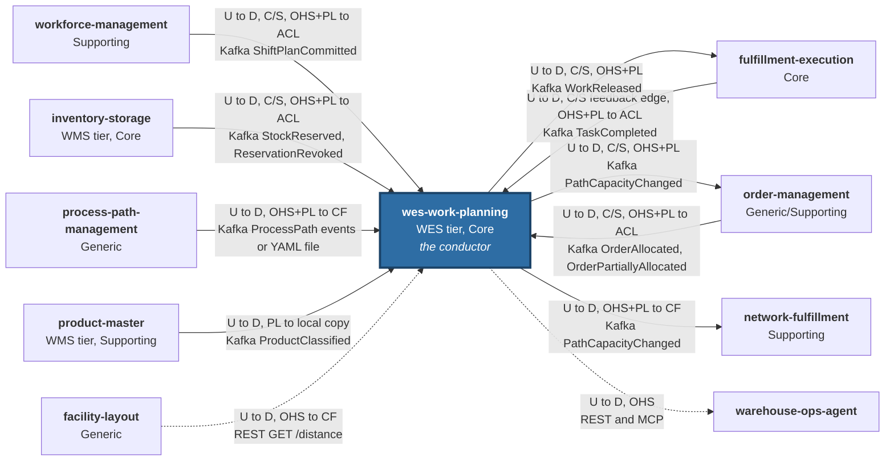
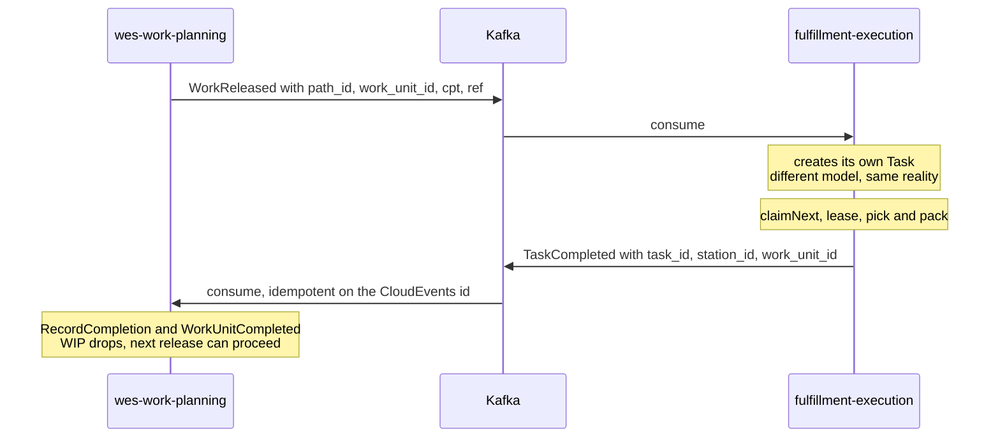

# Context map

This is the [ddd-crew context map](https://github.com/ddd-crew/context-mapping)
for this bounded context: **what is actually wired and running**, with the
strategic pattern on every edge. A context map that blurs wiring and wishes is
a wish list, so every edge below has a real producer and consumer, verified
against this service's `cmd/wes/main.go` and adapters and against each
sibling's `origin/develop`.

Pattern abbreviations: **U/D** upstream/downstream, **OHS** Open Host Service,
**PL** Published Language, **CF** Conformist, **ACL** Anti-Corruption Layer,
**C/S** Customer/Supplier, **P** Partnership, **SK** Shared Kernel.

## The map

Solid edges are Kafka (CloudEvents 1.0); dashed edges are synchronous calls.
Arrows point **from upstream to downstream** — so the REST lookup points
*into* this context even though it is the caller, because facility-layout
owns the facts.

Source: `internal/adapters/inbound/kafka/consumer.go`,
`internal/adapters/inbound/kafka/product_classification_consumer.go`,
`internal/adapters/outbound/kafka/publisher.go`,
`internal/adapters/outbound/kafkacatalog/consumer.go`,
`internal/adapters/outbound/productclassificationcopy/`,
`internal/adapters/outbound/traveldistance/client.go`, and each sibling's
consumer file listed below. Omits: the `warehouse-console` shell, which mounts
this repo's `web/` micro-frontend and calls the same REST API, and this
service's own analytics topic `warehouse.wes.analytics`.

## Relationships and evidence

| Counterpart | U/D | Pattern(s) | Technology | Status | Evidence |
|---|---|---|---|---|---|
| workforce-management | they U, we D | C/S; their OHS+PL, our ACL | Kafka `warehouse.workforce.events`, `com.warehouse.wes.workforce-management.shiftplan.ShiftPlanCommitted` | **Live** | ours: `internal/adapters/inbound/kafka/consumer.go` (`shiftPlanCommittedData`) |
| inventory-storage (events) | they U, we D | C/S; their OHS+PL, our ACL | Kafka `warehouse.inventory.events`, `com.warehouse.wms.inventory-storage.reservation.StockReserved` / `ReservationRevoked` | **Live** (projection feeds no decision yet) | ours: `consumer.go` (`inventoryEventData`) |
| product-master | they U, we D | their PL, our local copy | Kafka `warehouse.product-master.events`, `com.warehouse.wms.product-master.product.ProductClassified` (version-guarded copy, read at release) | **Wired**, `PRODUCT_CLASSIFICATION_MODE=kafka`; default `permissive` reads nothing | `internal/adapters/inbound/kafka/product_classification_consumer.go`, `internal/adapters/outbound/productclassificationcopy/` ([ADR-0035](../adr/0035-product-classification-local-copy.md); replaces the retired inventory-storage REST lookup of [ADR-0009](../adr/0009-product-classification-propagation-to-work-released.md)) |
| order-management (demand) | they U, we D | C/S; their OHS+PL, our ACL | Kafka `warehouse.order-management.events`, `com.warehouse.wes.order-management.order.OrderAllocated` / `OrderPartiallyAllocated` | **Live** | ours: `consumer.go` (`orderAllocatedData`), `usecases.ApplyOrderAllocated` ([ADR-0031](../adr/0031-order-allocated-choreography.md)) |
| order-management (capacity) | we U, they D | C/S; our OHS+PL | Kafka `warehouse.work-planning.events`, `com.warehouse.wes.work-planning.workpool.PathCapacityChanged` | **Live** | theirs: `internal/adapters/outbound/kafkapathcapacity/consumer.go` ([ADR-0018](../adr/0018-path-capacity-changed.md)) |
| process-path-management | they U, we D | their OHS+PL, we CF | Kafka `warehouse.process-path-management.events`, `com.warehouse.wes.process-path-management.processpath.*`; or a YAML file | **Live** with `PATH_CATALOGUE_SOURCE=kafka`; file source is the default | `internal/adapters/outbound/kafkacatalog/`, `internal/adapters/outbound/filecatalog/` ([ADR-0012](../adr/0012-process-path-catalogue-validation.md), [ADR-0030](../adr/0030-kafka-sourced-path-catalogue.md)) |
| facility-layout | they U, we D | their OHS, we CF | REST `GET /distance?from=&to=` at shift-plan commit | **Wired**, default `TRAVEL_DISTANCE_MODE=permissive` never calls out | `internal/adapters/outbound/traveldistance/` ([ADR-0017](../adr/0017-travel-distance-lookup-on-commit-shift-plan.md)) |
| fulfillment-execution (release) | we U, they D | C/S; our OHS+PL | Kafka `warehouse.work-planning.events`, `com.warehouse.wes.work-planning.workunit.WorkReleased` | **Live** | theirs: `internal/adapters/inbound/kafka/consumer.go` |
| fulfillment-execution (feedback) | they U, we D | C/S, roles reversed; their OHS+PL, our ACL | Kafka `warehouse.fulfillment.events`, `com.warehouse.wes.fulfillment-execution.task.TaskCompleted` | **Live** | ours: `consumer.go` (`taskCompletedData`), `usecases.ApplyTaskCompleted` |
| network-fulfillment | we U, they D | our OHS+PL, they CF | Kafka `warehouse.work-planning.events`, `PathCapacityChanged` | **Live** (behind their `CAPABILITY_OFFER_ENABLED`) | theirs: `internal/adapters/outbound/pathcapacitycache/consumer.go` |
| warehouse-ops-agent | we U, they D | our OHS | REST (`WES_WORK_PLANNING_REST_URL`, reports URL) and MCP (`get_backlog_telemetry`, `get_rebalance_recommendation`) | **Live** | theirs: `internal/config/config.go` |
| labor-performance | — | **Separate Ways** | none | **Deliberately absent**: does not consume `warehouse.work-planning.events` | `git grep` on its `origin/develop` finds no reference |
| warehouse-planning | — | **Separate Ways** | none at runtime | **Deliberately absent**: referenced only by its architecture fitness tests | its `internal/architecture/*_test.go` |
| any sibling | — | **Not SK, not P** | — | **Deliberately absent** | no shared types, schemas or tables; envelope duplicated by agreement ([ADR-0027](../adr/0027-cloudevents-mandatory-event-envelope.md)) |

Nine further event types on `warehouse.work-planning.events` (everything
except `WorkReleased` and `PathCapacityChanged`) are **published but
unconsumed** — see [Domain events](../ddd/domain-events.md).

### The loop

`WorkReleased` out to Execution, `TaskCompleted` back in, is a genuine closed
control loop rather than a one-way pipeline:

Source: `internal/application/usecases/release_next_work.go`,
`apply_task_completed.go`, `record_completion.go`.

The loop is what makes the WIP limit meaningful. Without the feedback edge,
WIP would only ever grow and a release-fed pool would deadlock at its limit
after `wipLimit` releases.

## Why each pattern

### WMS → WES is Customer/Supplier with an ACL in both directions

The platform's strategic reference states it directly: WMS is the upstream
customer of *demand* and WES the supplier of *fulfilment progress*; WMS
publishes an Open Host Service with a Published Language that WES conforms to;
and the boundary carries an **Anti-Corruption Layer in both directions**.

In this repository that ACL is not a diagram box, it is
`internal/adapters/inbound/kafka/consumer.go`: unexported structs
(`inventoryEventData`, `shiftPlanCommittedData`, `taskCompletedData`,
`orderAllocatedData`) hold the *foreign* shape and never leave the adapter.
What crosses into the application layer is a translated call, never a foreign
type.

### order-management → WES is Customer/Supplier, choreographed and fire-and-forget

`order-management` used to call `POST /paths/{pathId}/work-units`
synchronously — a coupling this service's owners rejected in favour of the
same publish-and-forget choreography every other upstream context uses. There
is **no reply event**: order-management does not learn from Kafka whether its
lines were enqueued. That is a confirmed v1 design choice
([ADR-0031](../adr/0031-order-allocated-choreography.md)).

### WES → Execution, order-management and network-fulfillment: we are the host

Downstream, the roles flip. `warehouse.work-planning.events` is *our* Open
Host Service and its CloudEvents types are *our* Published Language
(`apis/asyncapi.yaml`). fulfillment-execution builds its own `Task` from
`WorkReleased`; order-management and network-fulfillment each cache
`PathCapacityChanged` by path and cutoff. network-fulfillment is a pure
Conformist: we did nothing for it and do not know it is there.

### facility-layout and process-path-management: Conformist, read-only

This context conforms to two Generic contexts without owning or reshaping
their facts: the travel distance between two location codes, read once at
commit time, and the process-path catalogue every `pathId` is validated
against. Travel time, congestion and route choice stay here; geography and
the catalogue stay there.

## Three-tier view

| Tier | Horizon | Question | Services here |
|---|---|---|---|
| **WMS** | minutes → days | what needs to happen, and why | `inventory-storage`, `order-management` |
| **WES** | seconds → minutes | who does it, right now, in what order | **`wes-work-planning`**, `fulfillment-execution` |
| **WCS** | ms → seconds | how the machine performs the next step | *not built* — no equipment-control service exists in this platform |

`workforce-management` (Supporting), `facility-layout` and
`process-path-management` (Generic) sit beside the tiers: they supply labour
capacity, physical structure and the path catalogue to whoever asks.
