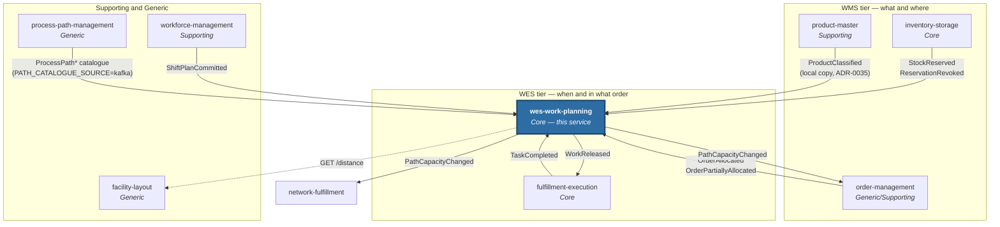

# Ecosystem

`warehouse-systems` is a fleet of Go services, each a bounded context with its
own model, its own database and its own deployment lifecycle. This one is the
WES tier's core — the conductor. This section covers the seven contexts this
service integrates with directly; the others (labor-performance,
warehouse-planning) have no edge to it, and warehouse-ops-agent and the
warehouse-console shell only call its public REST/MCP API.

| Page | Contents |
|---|---|
| [Context map](./context-map.md) | The ddd-crew context map: every Kafka and REST edge wired today, with U/D roles, patterns and evidence |
| [Integration events](./integration-events.md) | Every topic published and consumed, with real payloads and idempotency behaviour |
| [Sibling services](./sibling-services.md) | What each directly integrated sibling owns |

## The directly integrated services

Solid arrows are Kafka edges, dashed arrows are REST lookups this service
makes; every one of them touches this service. See the
[context map](./context-map.md) for the relationship patterns.
