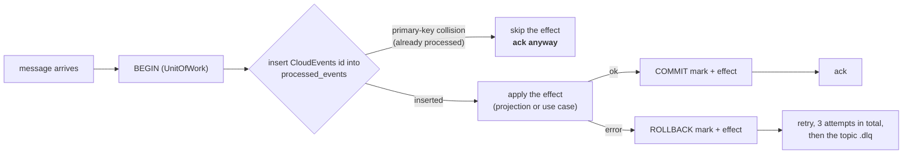

# Integration events

Every `warehouse-systems` service shares **one Kafka broker** — the
in-cluster Kafka release in the `warehouse` kind cluster, reachable from the
host at `localhost:9092`. This service does not run its own; its
`docker-compose.yml` runs Postgres only.

Client library: `github.com/segmentio/kafka-go` (pure Go, no cgo).

## The envelope: CloudEvents 1.0, mandatory

Every message on every topic — integration and analytics, produced and
consumed — is a **CloudEvents 1.0** event in structured content mode
([ADR-0027](../adr/0027-cloudevents-mandatory-event-envelope.md), a
fleet-wide rule). There is no flat envelope, no dual-write/dual-read and no
envelope toggle.

```json
{
  "specversion": "1.0",
  "id": "uuid-v4",
  "source": "/warehouse/wes-work-planning",
  "type": "com.warehouse.wes.work-planning.workunit.WorkReleased",
  "subject": "wu-10231",
  "time": "2026-08-21T22:00:00Z",
  "datacontenttype": "application/json",
  "dataschema": "urn:warehouse:wes-work-planning:events:WorkReleased:v1",
  "data": { }
}
```

- Every attribute above is required. `id` is a UUID v4 minted once per
  domain event and persisted with the outbox row. The Kafka **message key**
  on both topics is the aggregate id (the work unit id for WorkUnit events, the
  path id otherwise) — the same value as `subject` — so one aggregate's events
  share a partition and stay ordered
  ([ADR-0024](../adr/0024-kafka-hash-balancer-partition-affinity.md)). `time`
  is the domain clock.
- `type` = `com.warehouse.<subdomain>.<bounded-context>.<entity>.<EventName>`;
  `dataschema` = `urn:warehouse:<repo>:<events|analytics>:<EventName>:v<N>`.
- Every produced message carries the Kafka header
  `content-type: application/cloudevents+json; charset=UTF-8` next to the W3C
  trace headers.
- Built and validated with `github.com/cloudevents/sdk-go/v2/event` via the
  single helper package `internal/adapters/kafka/cloudevents`; the transport
  is still kafka-go.

## Published

### Topic `warehouse.work-planning.events`

| `type` | `data` | Published when | Consumed by |
|---|---|---|---|
| `com.warehouse.wes.work-planning.workunit.WorkReleased` | `{"path_id","work_unit_id","cpt","ref"}` (+ optional `required_capabilities`, `fragile`, `gift_wrap`, `line_no`) | `ReleaseNextWork` releases a unit | **`fulfillment-execution`** → creates a `Task` |
| `com.warehouse.wes.work-planning.workpool.PathCapacityChanged` | `{"path_id","cutoff_at","remaining_units","known"}` | `SampleBacklog` is called with `cutoffAt` set (ADR-0018) | **`order-management`** — its `kafkapathcapacity` adapter (own per-process consumer group, filters for this one event type) feeds its `ports.PathCapacity` cache, keyed by path and cutoff instant; **`network-fulfillment`** — its `pathcapacitycache` adapter replays the topic from the earliest offset under a process-unique group into an exact `(path_id, cutoff_at)` cache |

```json
{
  "specversion": "1.0",
  "id": "1d7e4b90-3c58-4d22-9a6f-8b1c0e5d7a23",
  "source": "/warehouse/wes-work-planning",
  "type": "com.warehouse.wes.work-planning.workunit.WorkReleased",
  "subject": "wu-10231",
  "time": "2026-08-21T22:12:30Z",
  "datacontenttype": "application/json",
  "dataschema": "urn:warehouse:wes-work-planning:events:WorkReleased:v1",
  "data": {
    "path_id": "pick-to-tote",
    "work_unit_id": "wu-10231",
    "cpt": "2026-08-22T02:00:00Z",
    "ref": "order-88421-line-3"
  }
}
```

`PathCapacityChanged` reports this path's currently remaining admission
capacity (its `WorkPool`'s `wipLimit` minus current WIP — always
non-negative under this aggregate's own enforced WIP-limit invariant),
correlated against a CPT cutoff timestamp — not process-path-management's
`cptId` string, which this service has zero dependency on. `known=false`
for a `FlowFed` path (no hard admission ceiling) or a `ReleaseFed` path with
no WIP limit provisioned. See [ADR-0018](../adr/0018-path-capacity-changed.md).

The other nine domain events (including `PathPlanDriftDetected`, ADR-0019)
are also written to this topic by the outbound adapter with a
`{"path_id": ...}`-shaped payload, but nothing consumes them
today. (Separately, whenever `EVENT_PUBLISHER=kafka` a second publisher also writes
every domain event to `warehouse.wes.analytics` for the analytics data product
— same CloudEvents `type`, `dataschema` `urn:warehouse:wes-work-planning:analytics:<EventName>:v1` — see [ADR-0011](../adr/0011-analytical-data-product.md).) See the [full catalogue](../api/events.md#events-published).

Set `EVENT_PUBLISHER=kafka` (with `KAFKA_BROKERS`) to publish here; the default
`log` publisher writes the same events to the log instead. Both implement the
same `ports.EventPublisher` interface, so the use cases cannot tell which is
wired.

## Consumed

Setting `KAFKA_BROKERS` starts the consumer automatically, **independent of
`EVENT_PUBLISHER`**. It reads four topics concurrently, one goroutine each,
under the consumer group `KAFKA_CONSUMER_GROUP` (default `wes-work-planning`,
shared by every deployed replica). A second process against the shared broker
— a developer's `go run`, the e2e harness — must set a unique value, or the
rebalance hands the single partition to one member and the other consumes
nothing while reporting healthy.

Every consumer decodes with `cloudevents.Decode` and dispatches on the
**full** CloudEvents `type` (exact strings below); unknown types are ignored.
A message that fails CloudEvents validation — including the retired flat
envelope — is published raw to `<topic>.dlq` and committed past without
retries (the catalogue consumer logs WARN and skips instead). Nothing ever
parses a legacy shape.

With `PATH_CATALOGUE_SOURCE=kafka` a fifth, separate consumer replays
process-path-management's topic — see
[below](#warehouseprocess-path-managementevents--the-process-path-catalogue).

### `warehouse.workforce.events` — `com.warehouse.wes.workforce-management.shiftplan.ShiftPlanCommitted`

```json
{
  "specversion": "1.0", "id": "...", "type": "com.warehouse.wes.workforce-management.shiftplan.ShiftPlanCommitted",
  "source": "/warehouse/workforce-management", "subject": "S1", "time": "...",
  "datacontenttype": "application/json", "dataschema": "...",
  "data": {
    "building_id": "BLD1", "shift_id": "S1", "path_id": "pick-a",
    "planned_heads": 7, "planned_rate": 95.5, "planned_hours": 8
  }
}
```

Projected into `LaborPlanObserved`, keyed by `path_id`, read at
`GET /paths/{pathId}/labor-plan-view`. Workforce publishes **one message per
path line** of its own shift plan, which is why the projection keys on
`path_id` with one row per path.

**It is not fed into this service's `ShiftPlan` aggregate or `CommitShiftPlan`
use case.** Same word, different bounded context —
[ADR-0006](../adr/0006-labor-plan-view-not-shift-plan.md). It is, however,
*compared* with our committed `PathPlan` for the same path when one exists:
the signed head difference is recorded on the view (`drift_heads`,
`drift_detected_at`) and `PathPlanDriftDetected` is published when they
disagree ([ADR-0019](../adr/0019-labor-plan-committed-shift-plan-reconciliation.md)).
The `path_id` must match the process-path catalogue or the event is
retried and dead-lettered.

### `warehouse.inventory.events` — `com.warehouse.wms.inventory-storage.reservation.StockReserved`, `...ReservationRevoked`

```json
{
  "specversion": "1.0", "id": "...", "type": "com.warehouse.wms.inventory-storage.reservation.StockReserved",
  "source": "/warehouse/inventory-storage", "subject": "...", "time": "...",
  "datacontenttype": "application/json", "dataschema": "...",
  "data": {"sku": "SKU-8891", "quantity": 4, "demand_ref": "order-88421"}
}
```

Both types carry the same `data` shape. `StockReserved` **decrements** the
observed usable count for that SKU; `ReservationRevoked` **increments** it
back. Projected into `UsableInventoryObserved`, keyed by **SKU**, read at
`GET /inventory-view/{sku}`.

Keyed by SKU and not by path deliberately: Inventory reservations are
SKU-scoped, and a SKU-to-path mapping does not exist in the domain.

### `warehouse.fulfillment.events` — `com.warehouse.wes.fulfillment-execution.task.TaskCompleted`

```json
{
  "specversion": "1.0", "id": "...", "type": "com.warehouse.wes.fulfillment-execution.task.TaskCompleted",
  "source": "/warehouse/fulfillment-execution", "subject": "t-551", "time": "...",
  "datacontenttype": "application/json", "dataschema": "...",
  "data": {"task_id": "t-551", "station_id": "pack-3", "work_unit_id": "wu-10231"}
}
```

`data.work_unit_id` maps to `RecordCompletionRequest.WorkUnitId` and reaches
the **existing** `RecordCompletion` use case — the exact code path
`POST /work-units/{id}/complete` uses — through `ApplyTaskCompleted`, which only
adds the atomic processed-event mark (see Idempotency below).

`work_unit_id` is the completed task's `orderRef`. For a PICK task released by
this service that is a real work unit. For a PACK task fulfillment-execution
created itself during rebin consolidation it is the **order id**, which this
context never planned. `RecordCompletion` then returns `ErrNotFound`, and the
consumer treats that as a deliberate skip: an INFO log with `event_id`,
`work_unit_id`, `task_id` and `task_type` (optional `data.task_type`, read for
logging only), marked processed, and neither retried nor dead-lettered. Any
other error is retried and then dead-lettered.

### `warehouse.order-management.events` — `com.warehouse.wes.order-management.order.OrderAllocated`, `...OrderPartiallyAllocated`

```json
{
  "specversion": "1.0", "id": "...", "type": "com.warehouse.wes.order-management.order.OrderAllocated",
  "source": "/warehouse/order-management", "subject": "order-1", "time": "...",
  "datacontenttype": "application/json", "dataschema": "...",
  "data": {
    "order_id": "order-1", "promise_date": "2026-08-22T02:00:00Z",
    "lines": [{"line_no": 1, "sku": "SKU-1", "path_id": "pick-a", "gift_wrap": false}]
  }
}
```

Both event types share this identical `data` shape and are handled
identically — both mean "these lines are ready to enqueue". This is the
event-choreography replacement for order-management's former **synchronous**
call to `POST /paths/{pathId}/work-units`: order-management (a new, 6th
bounded context, upstream Customer of this service) now publishes here once
it has allocated stock and locally marked an order line Released.

For each entry in `lines`, `ApplyOrderAllocated` first validates every line's
`path_id` against the process-path catalogue (an unknown path fails the
whole event, which is retried and then dead-lettered), then calls the
**existing** `EnqueueWorkUnit` use case once per line inside one atomic
scope, deriving a **deterministic**
`work_unit_id` as `"{order_id}-line-{line_no}"` and using `promise_date` as
the CPT — so the same order line
always maps to the same work unit, which is a second line of defense against
duplicate enqueues on top of the `processed_events` idempotency guard (see
below): a line already in the pool (`ErrDuplicateEntry`) is skipped as a
benign no-op ([ADR-0031](../adr/0031-order-allocated-choreography.md)).
Each line's `line_no` is also **stored** on the work unit (nullable
`work_units.line_no`) and published as the optional `line_no` on
`WorkReleased`, so a downstream consumer is told the line instead of parsing
the id ([ADR-0036](../adr/0036-work-unit-line-no-on-work-released.md)).

This integration is deliberately **fire-and-forget**: there is no reply event
back to order-management. The existing `WorkUnitCreated`/`WorkReleased`
events already published on `warehouse.work-planning.events` remain the only
observable signal of downstream progress — the same signal every other
`EnqueueWorkUnit` caller (including the REST endpoint) already relies on.
This was a confirmed v1 design choice made when rejecting order-management's
former synchronous HTTP coupling, not an oversight.

### `warehouse.network-inventory-planning.events` — `com.warehouse.wes.network-inventory-planning.workdemand.WorkDemandReleased`

```json
{
  "specversion": "1.0", "id": "...", "type": "com.warehouse.wes.network-inventory-planning.workdemand.WorkDemandReleased",
  "source": "/warehouse/network-inventory-planning", "subject": "demand-55601", "time": "...",
  "datacontenttype": "application/json",
  "dataschema": "urn:warehouse:network-inventory-planning:events:WorkDemandReleased:v1",
  "data": {
    "demand_id": "demand-55601", "work_kind": "TRANSFER_PICK", "transfer_ref": "TRF-2026-042",
    "path_id": "pick-transfer-a", "site_id": "site-north-1", "cpt": "2026-10-06T23:00:00Z",
    "sku": "SKU-T1", "quantity": 17
  }
}
```

One occurrence is one released **transfer demand leg**. `ApplyWorkDemandReleased`
(ADR-0033) validates `path_id` against the process-path catalogue and
`work_kind` against the declared enum (`TRANSFER_PICK | TRANSFER_DISPATCH |
TRANSFER_ARRIVAL`) before anything is enqueued — an unrecognized value fails
the whole message, which is retried and then dead-lettered. It then calls the
existing `EnqueueWorkUnit` once, under the deterministic `work_unit_id` =
`demand_id` (with `reference` = `demand_id` as the generic operator ref), so
the same demand always maps to the same work unit: a redelivery of the same
CloudEvents `id` is caught by the `processed_events` guard, and a *different*
event carrying a `demand_id` already in a pool is a benign no-op
(`ErrDuplicateEntry`), never a stall. The transfer metadata
(`transfer_ref`, `work_kind`, `site_id`, `quantity`; `sku` already existed)
rides the work unit and reappears as OPTIONAL fields on the published
`WorkReleased` payload. Like the order integration, this is
fire-and-forget: `WorkReleased` is the only signal back.

### `warehouse.process-path-management.events` — the process-path catalogue

Consumed only when `PATH_CATALOGUE_SOURCE=kafka` (the default `file` source
reads the same catalogue from YAML instead). The
`internal/adapters/outbound/kafkacatalog` consumer replays the topic from the
beginning under its own per-process consumer group — not
`KAFKA_CONSUMER_GROUP` — folding
`com.warehouse.wes.process-path-management.processpath.ProcessPathCreated`,
`...ProcessPathUpdated` and `...ProcessPathDeactivated` into the in-memory `pathcatalog.Catalogue` that
validates every `pathId`
([ADR-0012](../adr/0012-process-path-catalogue-validation.md)). Startup blocks
until the replay has caught up, then the consumer keeps following the topic
live. It is a state-rebuild, not an effect, so it does not use
`processed_events`.

## Idempotency

Kafka is at-least-once, so redelivery is normal, not exceptional. Every
consumer path here is idempotent by construction:



The mark and the effect are **one transaction**
([ADR-0028](../adr/0028-processed-event-mark-atomic-with-handling.md)). Before
that record the mark was committed first and on its own, so a failure after it
turned the retry into a silent "already processed" success and lost the event.

- **Postgres**: table `processed_events (event_id TEXT PRIMARY KEY, processed_at
  TIMESTAMPTZ)`, added by its own migration; the `event_id` column holds the
  CloudEvents `id`. The primary-key violation *is* the
  duplicate check — no read-then-write race.
- **In-memory**: a mutex-guarded `map[string]struct{}` with the same semantics.

Both sit behind one port, `ProcessedEventRepo.TryMarkProcessed(ctx, eventId,
at) (alreadyProcessed bool, err error)`.

Observable consequences, each covered by a unit test:

| Redelivered event | Effect |
|---|---|
| `StockReserved` | usable quantity is **not** double-decremented |
| `ReservationRevoked` | usable quantity is **not** double-incremented |
| `ShiftPlanCommitted` | the labour projection is **not** re-written |
| `TaskCompleted` | `RecordCompletion` is **not** called a second time |
| `OrderAllocated` / `OrderPartiallyAllocated` | `EnqueueWorkUnit` is **not** called a second time per line |
| `WorkDemandReleased` | `EnqueueWorkUnit` is **not** called a second time per demand |

The last one matters operationally: `WorkUnit.Complete` already rejects
double-completion with `ErrAlreadyCompleted`, so the aggregate would be safe
regardless. But without the `id` check, every redelivery would surface a
domain error from a perfectly normal Kafka behaviour, and an error that is
sometimes meaningless is an error nobody reads. Deduplicating first keeps
`ErrAlreadyCompleted` meaning what it says.

## Configuration

| Env var | Default | Effect |
|---|---|---|
| `KAFKA_BROKERS` | *(unset)* | Comma-separated brokers. **Setting it starts the inbound consumer.** |
| `KAFKA_CONSUMER_GROUP` | `wes-work-planning` | Consumer group of the integration-event consumer; set a unique value for any second process on the shared broker. |
| `EVENT_PUBLISHER` | `log` | `kafka` switches the outbound publisher; requires `KAFKA_BROKERS`. |
| `PATH_CATALOGUE_SOURCE` | `file` | `kafka` replays `warehouse.process-path-management.events` into the catalogue; requires `KAFKA_BROKERS`. |

## Verifying it end to end

There is a build-tagged integration test (`//go:build integration`) that
publishes real `ShiftPlanCommitted`- and `StockReserved`-shaped messages and
asserts the read models update, plus one for the Kafka-backed process-path
catalogue. Both start their own Kafka broker with testcontainers, so they need
Docker but no environment variables; the default `go test ./...` never needs a
broker:

```sh
go test -tags=integration ./internal/adapters/inbound/kafka/... ./internal/adapters/outbound/kafkacatalog/...
```

For a manual smoke test, see [Running locally](../overview/running-locally.md#connecting-to-the-shared-kafka-broker).
